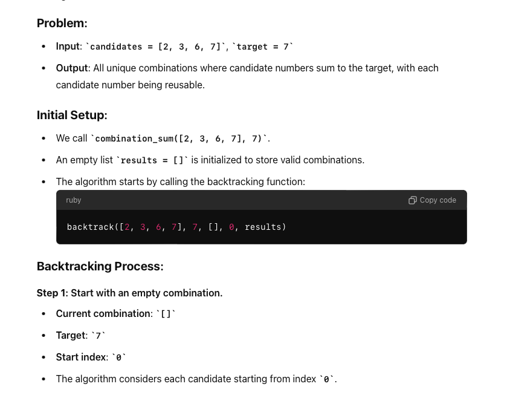
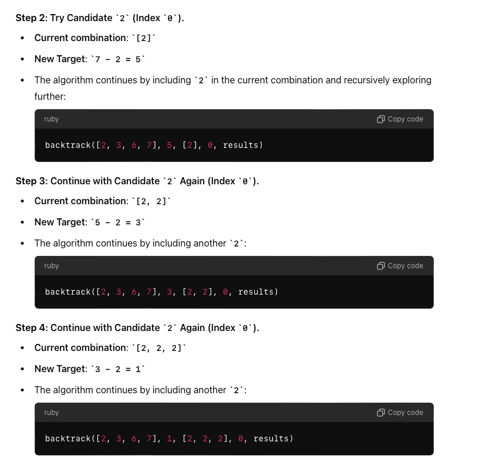
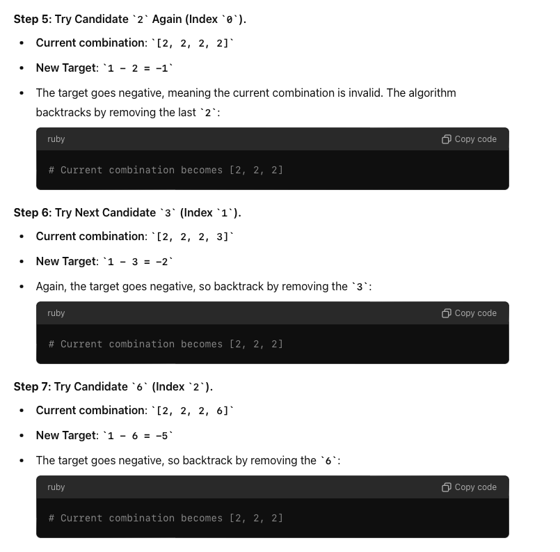
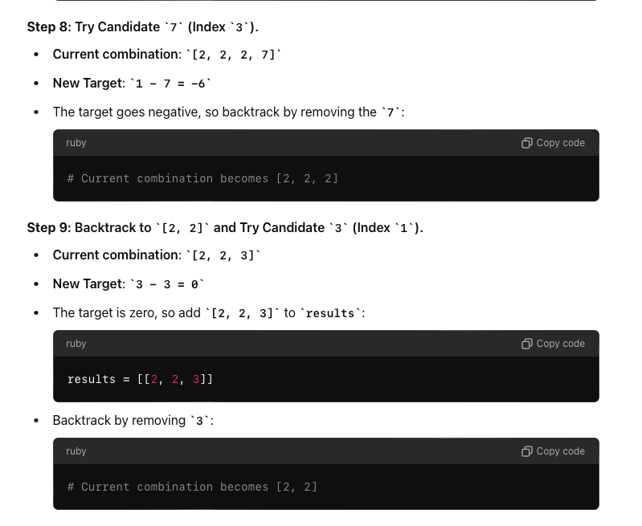
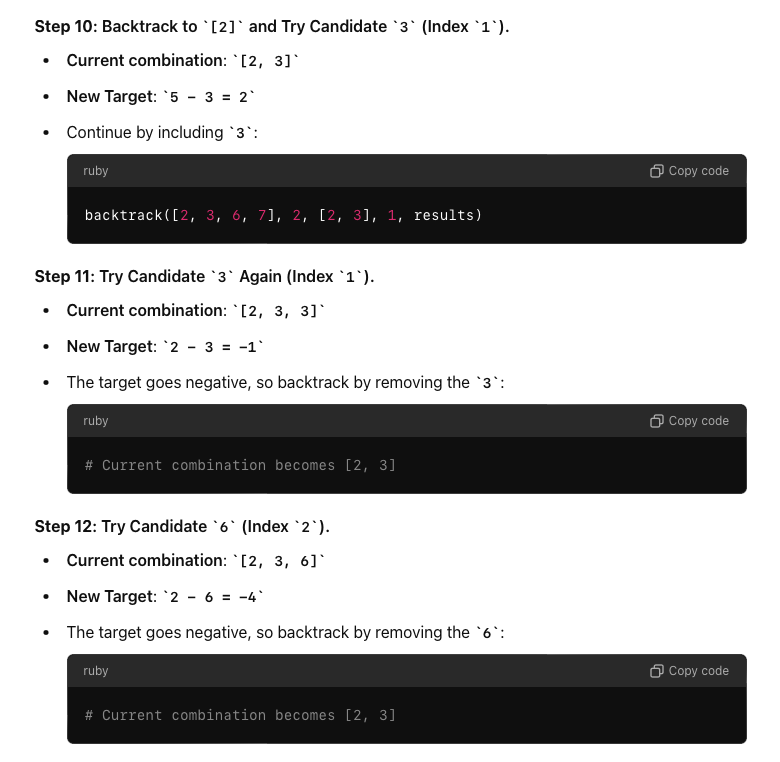
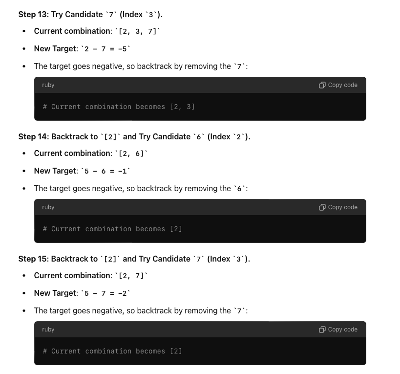
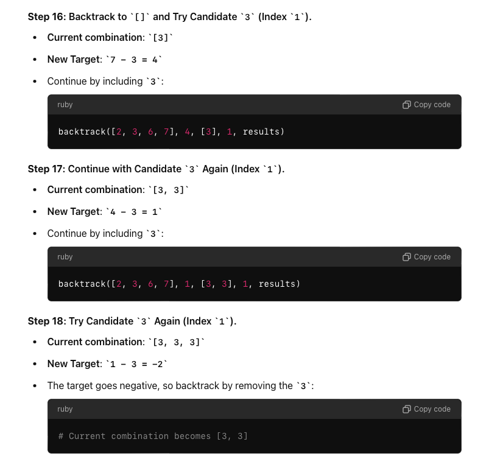
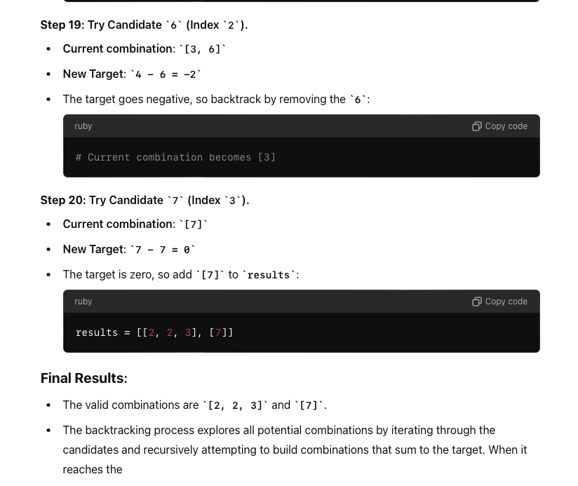

The "Combination Sum" problem is a classic algorithmic challenge that asks you to find all
unique combinations of numbers in a given set (or array) that sum up to a specified target.
Each number in the set can be used an unlimited number of times.

There are typically two variations of this problem:

**Combination Sum (Allow Repeated Use of Elements)**:
You can use the same element multiple times in the combination.
The problem asks for all unique combinations that sum to the target, where each combination
is a set of numbers that can include repeated elements.

Example:
Input: candidates = [2, 3, 6, 7], target = 7
Output: [[7], [2, 2, 3]]

**Combination Sum II (Each Element Used Once)**:
Each element in the array can be used only once in the combination.
The problem asks for all unique combinations that sum to the target, and each number in the array
can be used only once in each combination.

Example:
Input: candidates = [10, 1, 2, 7, 6, 1, 5], target = 8
Output: [[1, 1, 6], [1, 2, 5], [1, 7], [2, 6]]

**Standard Solution for the Combination Sum Problem**
The standard approach to solve the "Combination Sum" problem involves backtracking.
Here's a step-by-step breakdown of the standard solution:

1. Sort the Input Array:
   a. Sorting the array helps in two ways:
   b. It makes it easier to skip duplicate elements (important in "Combination Sum II").
   c. It allows early termination of the recursion if the current candidate exceeds the target.

2. Use Backtracking:
   Backtracking is a recursive method where you explore all possible combinations by adding each
   candidate to the current combination and then recursively attempting to add more candidates.
   a. If the current combination sums to the target, it's added to the list of results.
   b. If the combination exceeds the target, the recursion stops, and the algorithm backtracks by
   removing the last added candidate and trying the next one.

**Avoid Duplicates (For Combination Sum II)**:
a. Ensure that combinations are unique by skipping over duplicate elements during the recursive calls.
b. This is typically done by checking if the current candidate is the same as the previous one and skipping it if it is.

**Combination Sum - I - Dry Run**

