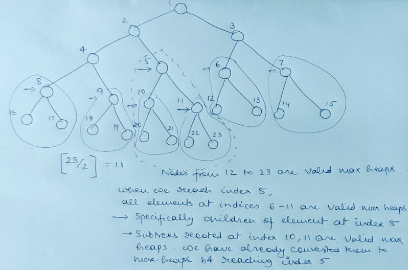

A binary heap data structure is a nearly complete binary tree meaning that it is
complete at all levels except possibly the last level which is filled from left to right

A max binary heap has the property that any node at index "i" in the binary heap
is always greater than or equal to its children
There is no special ordering amongst the sibling nodes
Max heap property is that for every node "i" other than the root
A[PARENT(i)] >= A[i] (we leave root because root does not have any parent)
Important Conclusions:

1.  Value of a node in a binary heap is at most the value of its parent
2.  Largest element in a max binary heap is stored at the root
3.  Subtree rooted at a node contains values no longer than the value contained at
    the node itself
4.  There is no special ordering amongst the Sibling Nodes in a binary heap

An array object A[1:n] with an attribute A.heap_size represents a binary heap where
elements A[1], A[2], A[3] .... A[A.heap_size - 1] of Array A represent nodes of the
binary heap, index "i" of element in Array corresponds to "ith" node of binary heap

Elements A[A.heap_size], A[A.heap_size + 1], A[A.heap_size + 2] ... A[n] are elements
in Array which do not represent nodes in binary heap

Because Binary Heap is a nearly complete binary tree, for a set of "n" nodes, its
maximum height is O(logn). This is because every node has 2 children except nodes
at the (bottom most - 1 level)

Central operation to maintain heap property is
MAX_HEAPIFY(A,i) 1. A is the array that contains elements which correspond to nodes in the binary heap 2. It is assumed that the subtrees rooted at children of node "i" - - left(i), right(i) are valid max heaps 3. However element A[i] may be less than its left or right child. A[i] may violate the
max-heap property 3. MAX_HEAPIFY procedure fixes this possible violation of A[i] node and ensures that the
binary heap rooted at node "i" is a max heap 4. It allows element at node "i" to float down in the max heap so that the subtree rooted
at node "i" obeys the max heap property by exchanging A[i] with its largest child. With
this exchange, it is possible that the node at index "largest" may be greater than its
children, this again may violate the max heap property 5. This method continues iterating downwards in the max heap until we reach a node where
the exchange results in the value at node being greater than its children (thus restoring
max heap property) or we reach a leaf node

Operations on Max Heap

1. Max Heapify: O(log n)
   Takes an array A and index "i" of node in binary heap and ensures that the binary heap
   rooted at index "i" is a max heap
2. Build Max Heap: O(n)
   Takes an array A with n elements (1..n) and converts this array into a max heap with
   heap size of "n".
   NOTE: !!IMP!! => We can build a max heap from an array of n elements in LINEAR TIME
   O(n \* log n) seems to be the obvious answer is correct but a deeper
   analysis reveals a tight upper bound of O(n)
3. Increase/Decrease Key: O(log n)
   Takes an array A, index "i" of node in binary heap and a new key value "k". When we
   update the value of node at index "i" in binary heap, max heap property may be violated.
   Max Heap property violation is fixed in this method
   a. If we increase the value of index "i" of node in binary heap, it may becomes greater
   than its parent violating the max heap property
   b. If we decrease the value of index "i" of node in binary heap, it may becomes smaller
   than its children violating the max heap property
4. Heapsort: O(n \* log n)
   Takes an array A, and sorts elements in it in ascending order

   **Build Max Heap**:

   1. All the elements in array starting from index "n/2" => n/2, (n/2 + 1), (n/2 + 2)...(n)
      are leaf nodes in binary heap. This means all these nodes are trivial max heaps. So,
      no operation needs to be perfromed on them
   2. An element at index "n/2" may not satisfy the max heap property because its children may
      be greater. However, children of element at index "n/2" are valid max-heaps since they
      are leaf nodes (they have no children).
   3. This satisfies the max-heapify requirement that children of node "i" must be valid max
      binary heaps before calling mex-heapify procedure on node "i". We can max-heapify(A, i)
      and continue moving left in the array. As we keep progressing, we create valid max-heaps
      at each step, so we can keep applying max-heapify algorithm on every index until we reach
      root. This is easiest to observe in a diagram

   

   **HeapSort**:

   1. Sorts all elements in an unsorted array
   2. 1st step is to build a max heap from elements of unsorted array. This guarantees that the
      element at the root is maximum element in the array. Max-heap has the largest element at
      root position
   3. Exchange A[1] with A[n] where A.heap_size = n. Largest element in the array is now at index
      "n" in array. But this may cause violation of max-heap property at root. All children of root
      are valid max-heaps (since we built a max heap in the 2nd step). Only root may violate the
      max-heap property. This lays the foundation of calling max_heapify(A, 1)
   4. Decrement heap_size by 1 => A.heap_size = n - 1
   5. Call max_heapify(A, 1) with A.heap_size = n - 1. This will ensure that the largest element in
      array A[1..n-1] is placed at the root.
   6. Repeat steps 3,4,5 until we reach index 1.
   7. All elements in the array are now sorted in ascending order
