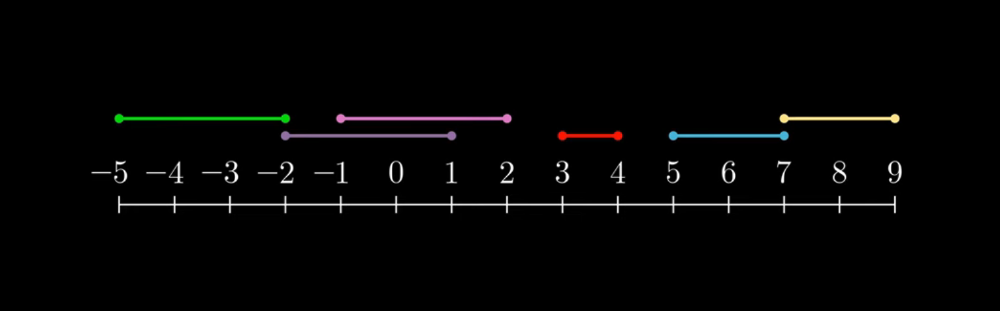
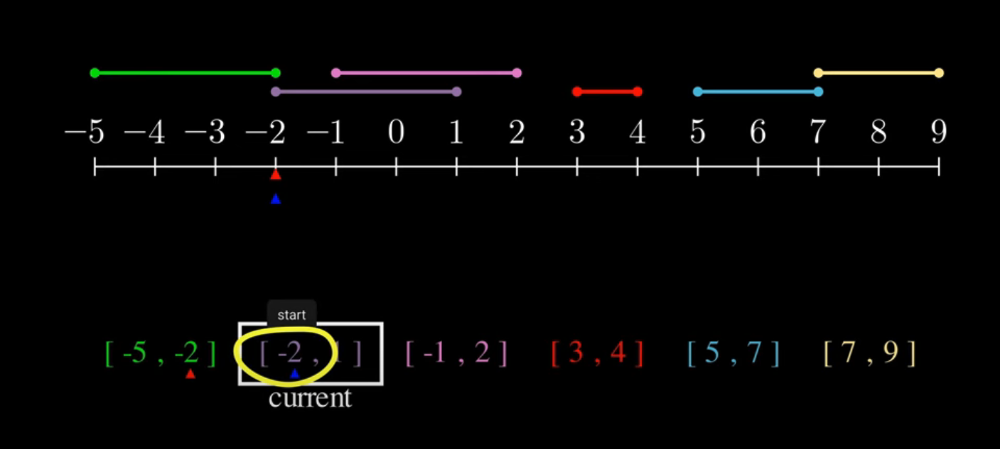

Problem statement is to merge overlapping intervals where each interval has
a start, end time.

If we have been given several time intervals and we want
to find the ones that overlap, we can visually place each interval on a
time scale (number line). Visually we can easily determine the time intervals
which overlap. Each interval will be placed on the number line in a way
where a line on top of number line will represent this interval - start of line will be start time of interval - end of line wil be end time of interval

We can transform this visual in code by sorting on start times of intervals

