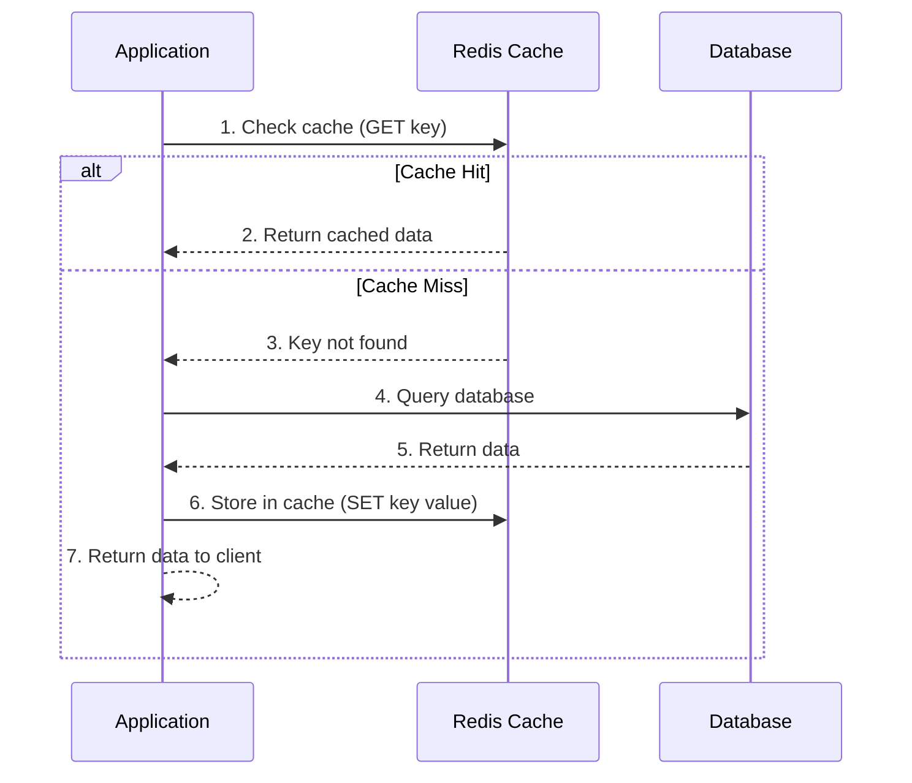
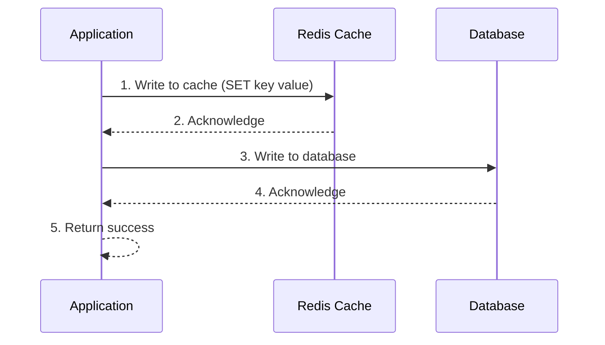
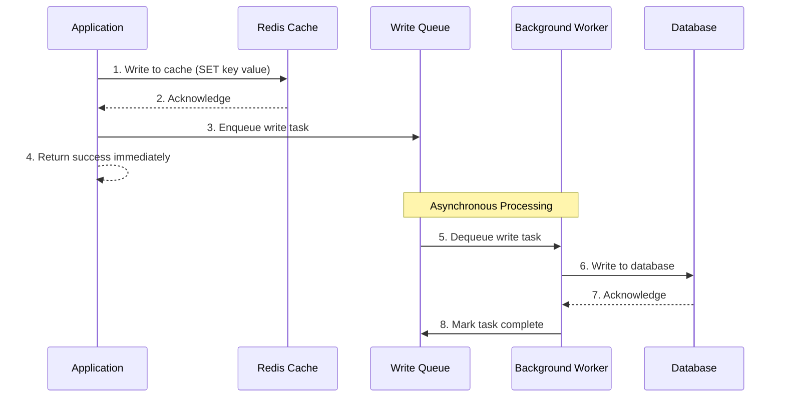
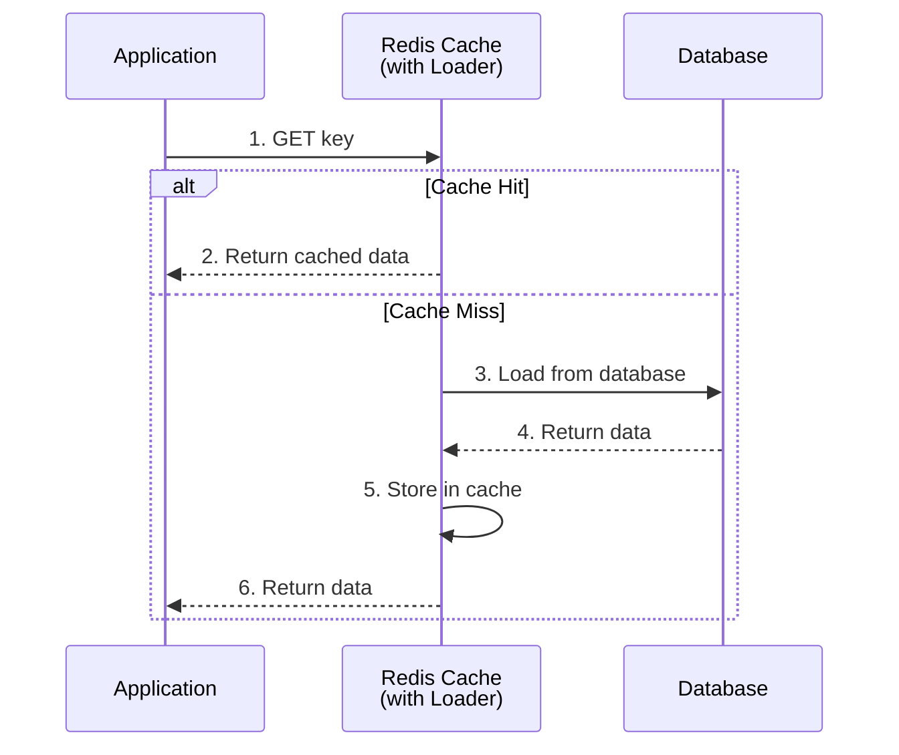
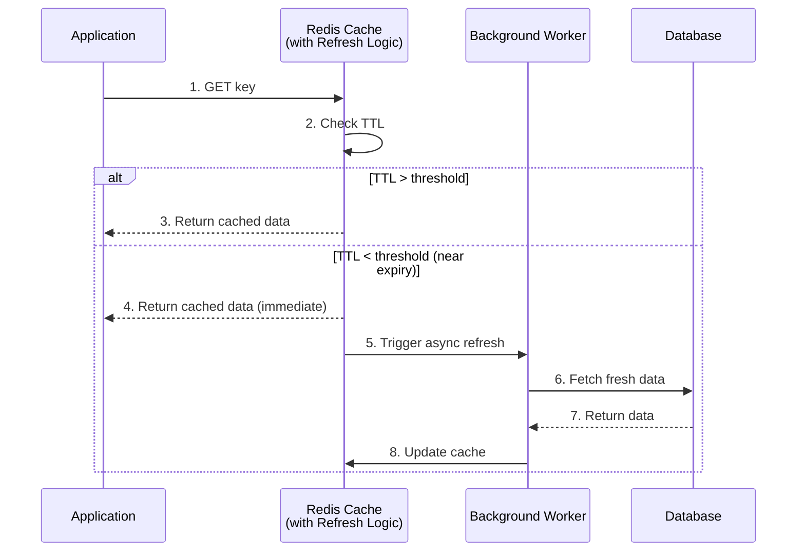

# Caching Strategies and Redis Implementation Guide

## Table of Contents

1. [Introduction](#introduction)
2. [Cache-Aside (Lazy Loading)](#cache-aside-lazy-loading)
3. [Write-Through Cache](#write-through-cache)
4. [Write-Back (Write-Behind) Cache](#write-back-write-behind-cache)
5. [Read-Through Cache](#read-through-cache)
6. [Refresh-Ahead Cache](#refresh-ahead-cache)
7. [TTL-Based Caching](#ttl-based-caching)
8. [Cache Eviction Strategies](#cache-eviction-strategies)
9. [Cache Invalidation Patterns](#cache-invalidation-patterns)
10. [Distributed Caching Patterns](#distributed-caching-patterns)
11. [Page Caching](#page-caching)
12. [Query Caching](#query-caching)
13. [Fragment Caching](#fragment-caching)
14. [Object Caching](#object-caching)
15. [CDN Caching](#cdn-caching)
16. [Browser Caching](#browser-caching)
17. [Best Practices and Trade-offs](#best-practices-and-trade-offs)

---

## Introduction

Caching is a critical technique for improving application performance by storing frequently accessed data in fast storage (memory) to reduce latency and database load. Redis, an in-memory data structure store, is one of the most popular caching solutions.

### Why Caching?

- **Performance**: Reduces latency by serving data from memory (microseconds) vs disk (milliseconds)
- **Scalability**: Reduces load on primary data stores (databases)
- **Cost Efficiency**: Fewer database queries mean lower infrastructure costs
- **Availability**: Can serve stale data during database outages

### Redis Overview

Redis is an open-source, in-memory data structure store that can be used as:

- Cache
- Message broker
- Database
- Session store

Key features:

- **Data Structures**: Strings, Hashes, Lists, Sets, Sorted Sets, Bitmaps
- **Persistence**: RDB snapshots, AOF (Append-Only File)
- **Replication**: Master-slave replication
- **Clustering**: Redis Cluster for horizontal scaling
- **Pub/Sub**: Real-time messaging

---

## Cache-Aside (Lazy Loading)

### Theory

**Cache-Aside** is the most common caching pattern. The application is responsible for loading data into the cache on demand.

**Flow:**

1. Application checks cache first
2. If cache hit → return data
3. If cache miss → fetch from database, store in cache, return data

**Characteristics:**

- ✅ Simple to implement
- ✅ Cache failures don't affect application (graceful degradation)
- ✅ Only frequently accessed data is cached
- ❌ Cache miss penalty (two round trips)
- ❌ Potential for stale data if not properly invalidated

### Architecture Diagram

#### Sequence Flow (Mermaid)



#### System Architecture (ASCII)

```
┌─────────────────────────────────────────────────────────────────┐
│                        APPLICATION LAYER                         │
├─────────────────────────────────────────────────────────────────┤
│                                                                  │
│                    ┌──────────────────┐                         │
│                    │  Application     │                         │
│                    │  (Business Logic)│                         │
│                    └────────┬─────────┘                         │
│                             │                                    │
│                             │ 1. GET key                         │
│                             ▼                                    │
└─────────────────────────────┼────────────────────────────────────┘
                               │
                               │
┌──────────────────────────────┼────────────────────────────────────┐
│                        CACHE LAYER                               │
├──────────────────────────────┼────────────────────────────────────┤
│                               │                                    │
│                    ┌──────────▼──────────┐                       │
│                    │   Redis Cache        │                       │
│                    │                      │                       │
│                    │  ┌────────────────┐ │                       │
│                    │  │  In-Memory     │ │                       │
│                    │  │  Key-Value     │ │                       │
│                    │  │  Store         │ │                       │
│                    │  └────────────────┘ │                       │
│                    └──────────┬──────────┘                       │
│                               │                                    │
│                    ┌──────────┴──────────┐                       │
│                    │  Cache Hit?         │                       │
│                    └──────────┬──────────┘                       │
│                               │                                    │
│                    ┌──────────┴──────────┐                       │
│                    │  YES: Return data    │                       │
│                    │  NO:  Cache miss     │                       │
│                    └──────────────────────┘                       │
└──────────────────────────────┼────────────────────────────────────┘
                                │
                                │ Cache Miss
                                │
┌───────────────────────────────┼────────────────────────────────────┐
│                         DATABASE LAYER                             │
├───────────────────────────────┼────────────────────────────────────┤
│                                │                                    │
│                     ┌──────────▼──────────┐                        │
│                     │   Database           │                        │
│                     │   (PostgreSQL/       │                        │
│                     │    MySQL/MongoDB)    │                        │
│                     └──────────┬──────────┘                        │
│                                │                                    │
│                     ┌──────────┴──────────┐                        │
│                     │  Query & Return     │                        │
│                     │  Data               │                        │
│                     └─────────────────────┘                        │
└────────────────────────────────────────────────────────────────────┘
```

### Implementation

```python
import redis
import json
from typing import Optional, Any
import time

class CacheAside:
    def __init__(self, redis_client: redis.Redis, db_connection):
        self.redis = redis_client
        self.db = db_connection
        self.default_ttl = 3600  # 1 hour

    def get_user(self, user_id: int) -> Optional[dict]:
        """Get user with cache-aside pattern"""
        cache_key = f"user:{user_id}"

        # Step 1: Try cache first
        cached_data = self.redis.get(cache_key)
        if cached_data:
            print(f"Cache HIT for user {user_id}")
            return json.loads(cached_data)

        # Step 2: Cache miss - fetch from database
        print(f"Cache MISS for user {user_id}")
        user_data = self.db.query(
            "SELECT * FROM users WHERE id = %s", (user_id,)
        )

        if not user_data:
            return None

        # Step 3: Store in cache for future requests
        self.redis.setex(
            cache_key,
            self.default_ttl,
            json.dumps(user_data)
        )

        return user_data

    def update_user(self, user_id: int, updates: dict):
        """Update user - invalidate cache"""
        # Update database
        self.db.update("users", updates, {"id": user_id})

        # Invalidate cache
        cache_key = f"user:{user_id}"
        self.redis.delete(cache_key)
        print(f"Cache invalidated for user {user_id}")

    def get_user_with_retry(self, user_id: int) -> Optional[dict]:
        """Cache-aside with graceful degradation"""
        cache_key = f"user:{user_id}"

        try:
            cached_data = self.redis.get(cache_key)
            if cached_data:
                return json.loads(cached_data)
        except redis.RedisError as e:
            print(f"Cache error (non-fatal): {e}")
            # Continue to database

        # Always fallback to database
        return self.db.query("SELECT * FROM users WHERE id = %s", (user_id,))
```

### Use Cases

- User profiles
- Product catalogs
- Configuration data
- API responses

---

## Write-Through Cache

### Theory

**Write-Through** ensures data is written to both cache and database synchronously.

**Flow:**

1. Application writes data
2. Write to cache
3. Write to database
4. Return success only after both complete

**Characteristics:**

- ✅ Data consistency (cache always matches database)
- ✅ No stale data
- ❌ Higher write latency (two writes)
- ❌ Cache failures can block writes
- ❌ Writes uncached data to cache (may not be read)

### Architecture Diagram

#### Sequence Flow (Mermaid)



#### System Architecture (ASCII)

```
┌─────────────────────────────────────────────────────────────────┐
│                        APPLICATION LAYER                         │
├─────────────────────────────────────────────────────────────────┤
│                                                                  │
│                    ┌──────────────────┐                         │
│                    │  Application     │                         │
│                    │  (Write Request) │                         │
│                    └────────┬─────────┘                         │
│                             │                                    │
│                             │ Write Data                         │
│                             ▼                                    │
└─────────────────────────────┼────────────────────────────────────┘
                               │
                               │
┌──────────────────────────────┼────────────────────────────────────┐
│                        CACHE LAYER                               │
├──────────────────────────────┼────────────────────────────────────┤
│                               │                                    │
│                    ┌──────────▼──────────┐                       │
│                    │   Redis Cache        │                       │
│                    │   SET key value      │                       │
│                    └──────────┬──────────┘                       │
│                               │                                    │
│                               │ Acknowledge                        │
└───────────────────────────────┼────────────────────────────────────┘
                                │
                                │
┌───────────────────────────────┼────────────────────────────────────┐
│                         DATABASE LAYER                             │
├───────────────────────────────┼────────────────────────────────────┤
│                                │                                    │
│                     ┌──────────▼──────────┐                        │
│                     │   Database           │                        │
│                     │   INSERT/UPDATE      │                        │
│                     └──────────┬──────────┘                        │
│                                │                                    │
│                                │ Acknowledge                        │
│                                │                                    │
│                     ┌──────────┴──────────┐                        │
│                     │  Both writes        │                        │
│                     │  completed          │                        │
│                     └─────────────────────┘                        │
└────────────────────────────────────────────────────────────────────┘

Note: Write succeeds only after BOTH cache and database writes complete
```

### Implementation

```python
class WriteThroughCache:
    def __init__(self, redis_client: redis.Redis, db_connection):
        self.redis = redis_client
        self.db = db_connection
        self.default_ttl = 3600

    def create_user(self, user_data: dict) -> int:
        """Create user with write-through pattern"""
        user_id = self.db.insert("users", user_data)
        cache_key = f"user:{user_id}"

        # Write to cache immediately
        user_data['id'] = user_id
        self.redis.setex(
            cache_key,
            self.default_ttl,
            json.dumps(user_data)
        )

        print(f"User {user_id} written to cache and database")
        return user_id

    def update_user(self, user_id: int, updates: dict):
        """Update with write-through"""
        # Update database first
        self.db.update("users", updates, {"id": user_id})

        # Update cache
        cache_key = f"user:{user_id}"
        updated_user = self.db.query(
            "SELECT * FROM users WHERE id = %s", (user_id,)
        )

        if updated_user:
            self.redis.setex(
                cache_key,
                self.default_ttl,
                json.dumps(updated_user)
            )

        print(f"User {user_id} updated in cache and database")

    def get_user(self, user_id: int) -> Optional[dict]:
        """Read - cache will have data due to write-through"""
        cache_key = f"user:{user_id}"
        cached_data = self.redis.get(cache_key)

        if cached_data:
            return json.loads(cached_data)

        # Fallback (shouldn't happen if write-through is used)
        return self.db.query("SELECT * FROM users WHERE id = %s", (user_id,))
```

### Use Cases

- Financial transactions
- Critical configuration
- User authentication tokens
- Real-time inventory

---

## Write-Back (Write-Behind) Cache

### Theory

**Write-Back** writes to cache immediately and asynchronously writes to database.

**Flow:**

1. Application writes data
2. Write to cache immediately
3. Return success
4. Asynchronously write to database in background

**Characteristics:**

- ✅ Very fast writes (only cache write)
- ✅ Can batch database writes
- ❌ Risk of data loss if cache fails before DB write
- ❌ Complex implementation (requires background workers)
- ❌ Eventual consistency

### Architecture Diagram

#### Sequence Flow (Mermaid)



#### System Architecture (ASCII)

```
┌─────────────────────────────────────────────────────────────────┐
│                        APPLICATION LAYER                         │
├─────────────────────────────────────────────────────────────────┤
│                                                                  │
│                    ┌──────────────────┐                         │
│                    │  Application     │                         │
│                    │  (Write Request) │                         │
│                    └────────┬─────────┘                         │
│                             │                                    │
│                             │ 1. Write to Cache                  │
│                             ▼                                    │
└─────────────────────────────┼────────────────────────────────────┘
                               │
                               │
┌──────────────────────────────┼────────────────────────────────────┐
│                        CACHE LAYER                               │
├──────────────────────────────┼────────────────────────────────────┤
│                               │                                    │
│                    ┌──────────▼──────────┐                       │
│                    │   Redis Cache        │                       │
│                    │   SET key value      │                       │
│                    └──────────┬──────────┘                       │
│                               │                                    │
│                               │ 2. Acknowledge                     │
└───────────────────────────────┼────────────────────────────────────┘
                                │
                                │ 3. Enqueue
                                │
┌───────────────────────────────┼────────────────────────────────────┐
│                      ASYNC PROCESSING LAYER                        │
├───────────────────────────────┼────────────────────────────────────┤
│                                │                                    │
│                     ┌──────────▼──────────┐                        │
│                     │   Write Queue       │                        │
│                     │   (Redis List/      │                        │
│                     │    Message Queue)   │                        │
│                     └──────────┬──────────┘                        │
│                                │                                    │
│                                │ 5. Dequeue                         │
│                     ┌──────────▼──────────┐                        │
│                     │  Background Worker   │                        │
│                     │  (Batch Processing)  │                        │
│                     └──────────┬──────────┘                        │
│                                │                                    │
│                                │ 6. Write to DB                     │
└────────────────────────────────┼────────────────────────────────────┘
                                 │
                                 │
┌─────────────────────────────────┼────────────────────────────────────┐
│                         DATABASE LAYER                              │
├─────────────────────────────────┼────────────────────────────────────┤
│                                  │                                    │
│                       ┌──────────▼──────────┐                        │
│                       │   Database           │                        │
│                       │   (Eventually       │                        │
│                       │    Consistent)      │                        │
│                       └────────────────────┘                        │
│                                                                      │
│  Note: Application returns success immediately after cache write     │
│        Database write happens asynchronously in background          │
└──────────────────────────────────────────────────────────────────────┘
```

### Implementation

```python
import threading
import queue
from datetime import datetime

class WriteBackCache:
    def __init__(self, redis_client: redis.Redis, db_connection):
        self.redis = redis_client
        self.db = db_connection
        self.write_queue = queue.Queue()
        self.default_ttl = 3600
        self.batch_size = 10
        self.flush_interval = 5  # seconds

        # Start background worker
        self.worker_thread = threading.Thread(target=self._background_writer, daemon=True)
        self.worker_thread.start()

    def create_user(self, user_data: dict) -> int:
        """Create user with write-back pattern"""
        # Generate ID (could use Redis INCR)
        user_id = self.redis.incr("user:id:counter")
        user_data['id'] = user_id
        cache_key = f"user:{user_id}"

        # Write to cache immediately
        self.redis.setex(
            cache_key,
            self.default_ttl,
            json.dumps(user_data)
        )

        # Enqueue for async database write
        self.write_queue.put({
            'operation': 'create',
            'table': 'users',
            'data': user_data,
            'timestamp': datetime.now().isoformat()
        })

        print(f"User {user_id} written to cache, queued for DB write")
        return user_id

    def update_user(self, user_id: int, updates: dict):
        """Update with write-back"""
        cache_key = f"user:{user_id}"

        # Get current cached data
        cached_data = self.redis.get(cache_key)
        if cached_data:
            user_data = json.loads(cached_data)
            user_data.update(updates)
        else:
            user_data = updates
            user_data['id'] = user_id

        # Update cache immediately
        self.redis.setex(
            cache_key,
            self.default_ttl,
            json.dumps(user_data)
        )

        # Enqueue for async database write
        self.write_queue.put({
            'operation': 'update',
            'table': 'users',
            'id': user_id,
            'data': updates,
            'timestamp': datetime.now().isoformat()
        })

    def _background_writer(self):
        """Background thread to flush writes to database"""
        batch = []
        last_flush = time.time()

        while True:
            try:
                # Collect writes with timeout
                try:
                    task = self.write_queue.get(timeout=1)
                    batch.append(task)
                except queue.Empty:
                    pass

                current_time = time.time()
                should_flush = (
                    len(batch) >= self.batch_size or
                    (batch and current_time - last_flush >= self.flush_interval)
                )

                if should_flush:
                    self._flush_batch(batch)
                    batch = []
                    last_flush = current_time

            except Exception as e:
                print(f"Error in background writer: {e}")
                time.sleep(1)

    def _flush_batch(self, batch: list):
        """Flush batch of writes to database"""
        print(f"Flushing {len(batch)} writes to database")

        for task in batch:
            try:
                if task['operation'] == 'create':
                    self.db.insert(task['table'], task['data'])
                elif task['operation'] == 'update':
                    self.db.update(
                        task['table'],
                        task['data'],
                        {'id': task['id']}
                    )
            except Exception as e:
                print(f"Error flushing task {task}: {e}")
                # Could implement retry logic here

    def get_user(self, user_id: int) -> Optional[dict]:
        """Read from cache"""
        cache_key = f"user:{user_id}"
        cached_data = self.redis.get(cache_key)

        if cached_data:
            return json.loads(cached_data)

        # Fallback to database (shouldn't happen often)
        return self.db.query("SELECT * FROM users WHERE id = %s", (user_id,))

    def flush(self):
        """Force flush all pending writes (for shutdown)"""
        batch = []
        while not self.write_queue.empty():
            batch.append(self.write_queue.get())

        if batch:
            self._flush_batch(batch)
```

### Use Cases

- Analytics events
- Logging
- User activity tracking
- High-frequency writes with eventual consistency requirements

---

## Read-Through Cache

### Theory

**Read-Through** uses a cache loader that automatically loads data from database on cache miss.

**Flow:**

1. Application requests data from cache
2. Cache checks if data exists
3. If miss, cache automatically loads from database
4. Cache stores and returns data

**Characteristics:**

- ✅ Application doesn't handle cache misses
- ✅ Centralized cache logic
- ❌ Requires cache-aware library/framework
- ❌ Cache failures affect reads

### Architecture Diagram

#### Sequence Flow (Mermaid)



#### System Architecture (ASCII)

```
┌─────────────────────────────────────────────────────────────────┐
│                        APPLICATION LAYER                         │
├─────────────────────────────────────────────────────────────────┤
│                                                                  │
│                    ┌──────────────────┐                         │
│                    │  Application     │                         │
│                    │  (Read Request)  │                         │
│                    └────────┬─────────┘                         │
│                             │                                    │
│                             │ 1. GET key                         │
│                             ▼                                    │
└─────────────────────────────┼────────────────────────────────────┘
                               │
                               │
┌──────────────────────────────┼────────────────────────────────────┐
│                    CACHE LAYER (with Loader)                     │
├──────────────────────────────┼────────────────────────────────────┤
│                               │                                    │
│                    ┌──────────▼──────────┐                       │
│                    │   Redis Cache        │                       │
│                    │   (Cache Loader)    │                       │
│                    │                      │                       │
│                    │  ┌────────────────┐ │                       │
│                    │  │  Check Cache   │ │                       │
│                    │  └────────┬───────┘ │                       │
│                    │           │          │                       │
│                    │  ┌────────┴───────┐ │                       │
│                    │  │ Cache Hit?     │ │                       │
│                    │  └────────┬───────┘ │                       │
│                    │           │          │                       │
│                    │  ┌────────┴───────┐ │                       │
│                    │  │ YES: Return    │ │                       │
│                    │  │ NO: Auto-load  │ │                       │
│                    │  └────────────────┘ │                       │
│                    └──────────┬──────────┘                       │
│                               │                                    │
│                               │ Cache Miss - Auto Load             │
└───────────────────────────────┼────────────────────────────────────┘
                                │
                                │
┌───────────────────────────────┼────────────────────────────────────┐
│                         DATABASE LAYER                             │
├───────────────────────────────┼────────────────────────────────────┤
│                                │                                    │
│                     ┌──────────▼──────────┐                        │
│                     │   Database           │                        │
│                     │   (Data Source)      │                        │
│                     └──────────┬──────────┘                        │
│                                │                                    │
│                                │ 4. Return Data                     │
│                                │                                    │
│                     ┌──────────┴──────────┐                        │
│                     │  Cache stores data  │                        │
│                     │  automatically      │                        │
│                     └─────────────────────┘                        │
│                                                                     │
│  Note: Application doesn't handle cache misses - cache does it     │
└────────────────────────────────────────────────────────────────────┘
```

### Implementation

```python
class ReadThroughCache:
    def __init__(self, redis_client: redis.Redis, db_connection):
        self.redis = redis_client
        self.db = db_connection
        self.default_ttl = 3600

    def get_user(self, user_id: int) -> Optional[dict]:
        """Read-through: cache handles loading"""
        cache_key = f"user:{user_id}"

        # Try to get from cache
        cached_data = self.redis.get(cache_key)
        if cached_data:
            return json.loads(cached_data)

        # Cache miss - load from database
        print(f"Cache miss for user {user_id}, loading from DB")
        user_data = self.db.query(
            "SELECT * FROM users WHERE id = %s", (user_id,)
        )

        if not user_data:
            return None

        # Store in cache for future reads
        self.redis.setex(
            cache_key,
            self.default_ttl,
            json.dumps(user_data)
        )

        return user_data

    def get_user_with_loader(self, user_id: int) -> Optional[dict]:
        """Read-through with explicit loader function"""
        cache_key = f"user:{user_id}"

        # Use Redis GET with fallback loader
        def loader():
            return self.db.query(
                "SELECT * FROM users WHERE id = %s", (user_id,)
            )

        return self._get_or_load(cache_key, loader)

    def _get_or_load(self, key: str, loader_func):
        """Generic read-through helper"""
        # Try cache
        cached = self.redis.get(key)
        if cached:
            return json.loads(cached)

        # Load from source
        data = loader_func()
        if data:
            self.redis.setex(
                key,
                self.default_ttl,
                json.dumps(data)
            )
        return data

    def get_users_batch(self, user_ids: list) -> dict:
        """Batch read-through with pipeline"""
        cache_keys = [f"user:{uid}" for uid in user_ids]

        # Pipeline for batch GET
        pipe = self.redis.pipeline()
        for key in cache_keys:
            pipe.get(key)
        results = pipe.execute()

        # Process results
        users = {}
        missing_ids = []

        for i, (user_id, cached_data) in enumerate(zip(user_ids, results)):
            if cached_data:
                users[user_id] = json.loads(cached_data)
            else:
                missing_ids.append(user_id)

        # Load missing users from database
        if missing_ids:
            db_users = self.db.query(
                "SELECT * FROM users WHERE id IN %s", (tuple(missing_ids),)
            )

            # Store in cache and add to results
            pipe = self.redis.pipeline()
            for user in db_users:
                users[user['id']] = user
                pipe.setex(
                    f"user:{user['id']}",
                    self.default_ttl,
                    json.dumps(user)
                )
            pipe.execute()

        return users
```

### Use Cases

- ORM frameworks (Django, SQLAlchemy)
- API response caching
- Configuration management
- Content delivery

---

## Refresh-Ahead Cache

### Theory

**Refresh-Ahead** proactively refreshes cache entries before they expire.

**Flow:**

1. Application reads from cache
2. Cache checks expiration time
3. If near expiration, trigger background refresh
4. Return current (possibly stale) data immediately
5. Background refresh updates cache

**Characteristics:**

- ✅ Reduces cache miss latency
- ✅ Always serves data (even during refresh)
- ✅ Better user experience
- ❌ More complex implementation
- ❌ May refresh unused data

### Architecture Diagram

#### Sequence Flow (Mermaid)



#### System Architecture (ASCII)

```
┌─────────────────────────────────────────────────────────────────┐
│                        APPLICATION LAYER                         │
├─────────────────────────────────────────────────────────────────┤
│                                                                  │
│                    ┌──────────────────┐                         │
│                    │  Application     │                         │
│                    │  (Read Request)  │                         │
│                    └────────┬─────────┘                         │
│                             │                                    │
│                             │ 1. GET key                         │
│                             ▼                                    │
└─────────────────────────────┼────────────────────────────────────┘
                               │
                               │
┌──────────────────────────────┼────────────────────────────────────┐
│                    CACHE LAYER (with Refresh)                    │
├──────────────────────────────┼────────────────────────────────────┤
│                               │                                    │
│                    ┌──────────▼──────────┐                       │
│                    │   Redis Cache        │                       │
│                    │                      │                       │
│                    │  ┌────────────────┐ │                       │
│                    │  │  Check TTL     │ │                       │
│                    │  └────────┬───────┘ │                       │
│                    │           │          │                       │
│                    │  ┌────────┴───────┐ │                       │
│                    │  │ TTL > 20%?    │ │                       │
│                    │  └────────┬───────┘ │                       │
│                    │           │          │                       │
│                    │  ┌────────┴───────┐ │                       │
│                    │  │ YES: Return   │ │                       │
│                    │  │ NO: Return +  │ │                       │
│                    │  │    Refresh    │ │                       │
│                    │  └───────────────┘ │                       │
│                    └──────────┬──────────┘                       │
│                               │                                    │
│                               │ 4. Return immediately              │
│                               │ 5. Trigger refresh                │
└───────────────────────────────┼────────────────────────────────────┘
                                │
                                │
┌───────────────────────────────┼────────────────────────────────────┐
│                    BACKGROUND WORKER LAYER                        │
├───────────────────────────────┼────────────────────────────────────┤
│                                │                                    │
│                     ┌──────────▼──────────┐                        │
│                     │  Refresh Worker     │                        │
│                     │  (Async Refresh)    │                        │
│                     └──────────┬──────────┘                        │
│                                │                                    │
│                                │ 6. Fetch fresh data                │
└────────────────────────────────┼────────────────────────────────────┘
                                 │
                                 │
┌─────────────────────────────────┼────────────────────────────────────┐
│                         DATABASE LAYER                              │
├─────────────────────────────────┼────────────────────────────────────┤
│                                  │                                    │
│                       ┌──────────▼──────────┐                        │
│                       │   Database           │                        │
│                       │   (Fresh Data)       │                        │
│                       └──────────┬──────────┘                        │
│                                  │                                    │
│                                  │ 7. Return fresh data                │
│                                  │                                    │
│                       ┌──────────┴──────────┐                        │
│                       │  Update cache with  │                        │
│                       │  fresh data         │                        │
│                       └─────────────────────┘                        │
│                                                                      │
│  Note: User gets immediate response (possibly stale)                │
│        Cache refreshed in background for next request                │
└──────────────────────────────────────────────────────────────────────┘
```

### Implementation

```python
import threading
import time

class RefreshAheadCache:
    def __init__(self, redis_client: redis.Redis, db_connection,
                 refresh_threshold: float = 0.2):
        """
        refresh_threshold: Refresh when TTL < threshold * original_ttl
        e.g., 0.2 means refresh when 20% of TTL remains
        """
        self.redis = redis_client
        self.db = db_connection
        self.default_ttl = 3600
        self.refresh_threshold = refresh_threshold
        self.refresh_queue = queue.Queue()
        self.refreshing = set()  # Track keys being refreshed

        # Start refresh worker
        self.worker_thread = threading.Thread(target=self._refresh_worker, daemon=True)
        self.worker_thread.start()

    def get_user(self, user_id: int) -> Optional[dict]:
        """Get user with refresh-ahead"""
        cache_key = f"user:{user_id}"

        # Get data and TTL
        pipe = self.redis.pipeline()
        pipe.get(cache_key)
        pipe.ttl(cache_key)
        results = pipe.execute()

        cached_data, ttl = results

        if cached_data:
            user_data = json.loads(cached_data)

            # Check if refresh is needed
            if ttl > 0 and ttl < (self.default_ttl * self.refresh_threshold):
                # Trigger background refresh if not already refreshing
                if cache_key not in self.refreshing:
                    self._trigger_refresh(user_id, cache_key)

            return user_data

        # Cache miss - load synchronously
        return self._load_user(user_id, cache_key)

    def _trigger_refresh(self, user_id: int, cache_key: str):
        """Trigger background refresh"""
        if cache_key in self.refreshing:
            return

        self.refreshing.add(cache_key)
        self.refresh_queue.put({
            'user_id': user_id,
            'cache_key': cache_key,
            'timestamp': time.time()
        })
        print(f"Triggered refresh for user {user_id}")

    def _refresh_worker(self):
        """Background worker to refresh cache entries"""
        while True:
            try:
                task = self.refresh_queue.get(timeout=1)
                user_id = task['user_id']
                cache_key = task['cache_key']

                # Load fresh data
                user_data = self.db.query(
                    "SELECT * FROM users WHERE id = %s", (user_id,)
                )

                if user_data:
                    # Update cache
                    self.redis.setex(
                        cache_key,
                        self.default_ttl,
                        json.dumps(user_data)
                    )
                    print(f"Refreshed cache for user {user_id}")
                else:
                    # User deleted - remove from cache
                    self.redis.delete(cache_key)

                self.refreshing.discard(cache_key)

            except queue.Empty:
                continue
            except Exception as e:
                print(f"Error in refresh worker: {e}")
                if 'cache_key' in locals():
                    self.refreshing.discard(cache_key)
                time.sleep(1)

    def _load_user(self, user_id: int, cache_key: str) -> Optional[dict]:
        """Load user from database and cache"""
        user_data = self.db.query(
            "SELECT * FROM users WHERE id = %s", (user_id,)
        )

        if user_data:
            self.redis.setex(
                cache_key,
                self.default_ttl,
                json.dumps(user_data)
            )

        return user_data
```

### Use Cases

- High-traffic read-heavy applications
- Real-time dashboards
- News feeds
- Stock prices

---

## TTL-Based Caching

### Theory

**TTL (Time-To-Live)** is a fundamental caching mechanism where entries expire after a set time.

**Types:**

- **Absolute TTL**: Expires at specific time
- **Relative TTL**: Expires after duration from creation
- **Sliding TTL**: TTL resets on access

### Implementation

```python
class TTLBasedCache:
    def __init__(self, redis_client: redis.Redis):
        self.redis = redis_client

    def set_with_absolute_ttl(self, key: str, value: Any, expire_at: datetime):
        """Set with absolute expiration time"""
        ttl_seconds = int((expire_at - datetime.now()).total_seconds())
        if ttl_seconds > 0:
            self.redis.setex(key, ttl_seconds, json.dumps(value))

    def set_with_relative_ttl(self, key: str, value: Any, ttl_seconds: int):
        """Set with relative TTL"""
        self.redis.setex(key, ttl_seconds, json.dumps(value))

    def set_with_sliding_ttl(self, key: str, value: Any, ttl_seconds: int):
        """Set with sliding TTL (resets on access)"""
        self.redis.setex(key, ttl_seconds, json.dumps(value))

    def get_with_sliding_ttl(self, key: str, ttl_seconds: int) -> Optional[Any]:
        """Get and reset TTL (sliding expiration)"""
        value = self.redis.get(key)
        if value:
            # Reset TTL
            self.redis.expire(key, ttl_seconds)
            return json.loads(value)
        return None

    def get_ttl(self, key: str) -> int:
        """Get remaining TTL in seconds"""
        return self.redis.ttl(key)

    def extend_ttl(self, key: str, additional_seconds: int):
        """Extend TTL by additional seconds"""
        current_ttl = self.redis.ttl(key)
        if current_ttl > 0:
            new_ttl = current_ttl + additional_seconds
            self.redis.expire(key, new_ttl)

    def set_with_multiple_ttls(self, key: str, value: Any,
                               short_ttl: int, long_ttl: int):
        """Set with different TTLs based on access pattern"""
        # Store with short TTL initially
        self.redis.setex(key, short_ttl, json.dumps(value))

        # Use Redis keyspace notifications to extend TTL on access
        # (Requires Redis configuration: notify-keyspace-events Ex)
```

### TTL Strategies

```python
class SmartTTLCache:
    def __init__(self, redis_client: redis.Redis):
        self.redis = redis_client
        self.access_counts = {}  # Track access frequency

    def adaptive_ttl(self, key: str, value: Any, base_ttl: int = 3600):
        """Adaptive TTL based on access frequency"""
        access_count = self.access_counts.get(key, 0)

        # More frequently accessed = longer TTL
        if access_count > 100:
            ttl = base_ttl * 4  # 4 hours
        elif access_count > 50:
            ttl = base_ttl * 2  # 2 hours
        else:
            ttl = base_ttl  # 1 hour

        self.redis.setex(key, ttl, json.dumps(value))

    def get_with_tracking(self, key: str) -> Optional[Any]:
        """Get and track access"""
        value = self.redis.get(key)
        if value:
            self.access_counts[key] = self.access_counts.get(key, 0) + 1
        return json.loads(value) if value else None
```

---

## Cache Eviction Strategies

### Theory

When cache is full, Redis uses eviction policies to decide which keys to remove.

### Redis Eviction Policies

1. **noeviction**: Don't evict, return errors on write
2. **allkeys-lru**: Evict least recently used keys
3. **allkeys-lfu**: Evict least frequently used keys
4. **volatile-lru**: Evict LRU among keys with TTL
5. **volatile-lfu**: Evict LFU among keys with TTL
6. **volatile-ttl**: Evict keys with shortest TTL
7. **volatile-random**: Random eviction among keys with TTL
8. **allkeys-random**: Random eviction

### Implementation

```python
class EvictionAwareCache:
    def __init__(self, redis_client: redis.Redis):
        self.redis = redis_client

    def configure_eviction(self, policy: str = "allkeys-lru", maxmemory: str = "256mb"):
        """Configure Redis eviction (requires Redis config)"""
        # Note: This typically requires redis.conf changes
        # For demonstration, showing how to check current policy
        info = self.redis.info("memory")
        print(f"Max memory: {info.get('maxmemory', 'unlimited')}")
        print(f"Eviction policy: {info.get('maxmemory_policy', 'unknown')}")

    def implement_lru_manually(self):
        """Manual LRU implementation using sorted sets"""
        def set_with_lru(key: str, value: Any, ttl: int = 3600):
            # Store value
            self.redis.setex(key, ttl, json.dumps(value))

            # Update access time in sorted set
            access_time = time.time()
            self.redis.zadd("lru:access_times", {key: access_time})

        def get_with_lru(key: str) -> Optional[Any]:
            value = self.redis.get(key)
            if value:
                # Update access time
                access_time = time.time()
                self.redis.zadd("lru:access_times", {key: access_time})
                return json.loads(value)
            return None

        def evict_lru(count: int = 1):
            # Get least recently used keys
            lru_keys = self.redis.zrange("lru:access_times", 0, count - 1)
            for key in lru_keys:
                self.redis.delete(key)
                self.redis.zrem("lru:access_times", key)
            return lru_keys

        return set_with_lru, get_with_lru, evict_lru

    def implement_lfu_manually(self):
        """Manual LFU implementation"""
        def set_with_lfu(key: str, value: Any, ttl: int = 3600):
            self.redis.setex(key, ttl, json.dumps(value))
            # Initialize frequency
            self.redis.hset("lfu:frequencies", key, 1)

        def get_with_lfu(key: str) -> Optional[Any]:
            value = self.redis.get(key)
            if value:
                # Increment frequency
                self.redis.hincrby("lfu:frequencies", key, 1)
                return json.loads(value)
            return None

        def evict_lfu(count: int = 1):
            # Get frequencies
            frequencies = self.redis.hgetall("lfu:frequencies")
            # Sort by frequency and get least frequent
            sorted_keys = sorted(frequencies.items(), key=lambda x: int(x[1]))[:count]
            for key, _ in sorted_keys:
                self.redis.delete(key)
                self.redis.hdel("lfu:frequencies", key)
            return [k for k, _ in sorted_keys]

        return set_with_lfu, get_with_lfu, evict_lfu
```

---

## Cache Invalidation Patterns

### Theory

Cache invalidation is crucial for maintaining data consistency.

### Invalidation Strategies

1. **Time-based**: TTL expiration
2. **Event-based**: Invalidate on data change
3. **Tag-based**: Invalidate by tags/categories
4. **Version-based**: Use version numbers
5. **Wildcard**: Invalidate matching patterns

### Implementation

```python
class CacheInvalidation:
    def __init__(self, redis_client: redis.Redis):
        self.redis = redis_client

    def invalidate_on_update(self, user_id: int):
        """Simple invalidation on update"""
        cache_key = f"user:{user_id}"
        self.redis.delete(cache_key)

    def tag_based_invalidation(self):
        """Tag-based invalidation pattern"""
        def set_with_tags(key: str, value: Any, tags: list, ttl: int = 3600):
            # Store value
            self.redis.setex(key, ttl, json.dumps(value))

            # Store key under each tag
            for tag in tags:
                tag_key = f"tag:{tag}"
                self.redis.sadd(tag_key, key)
                self.redis.expire(tag_key, ttl)

        def invalidate_by_tag(tag: str):
            """Invalidate all keys with a specific tag"""
            tag_key = f"tag:{tag}"
            keys = self.redis.smembers(tag_key)

            if keys:
                # Delete all keys
                self.redis.delete(*keys)
                # Delete tag set
                self.redis.delete(tag_key)
                return len(keys)
            return 0

        return set_with_tags, invalidate_by_tag

    def version_based_invalidation(self):
        """Version-based invalidation"""
        def set_with_version(key: str, value: Any, version: int, ttl: int = 3600):
            versioned_key = f"{key}:v{version}"
            self.redis.setex(versioned_key, ttl, json.dumps(value))

            # Store current version
            self.redis.set(f"{key}:current_version", version)

        def get_with_version(key: str) -> Optional[Any]:
            current_version = self.redis.get(f"{key}:current_version")
            if current_version:
                versioned_key = f"{key}:v{current_version.decode()}"
                return self.redis.get(versioned_key)
            return None

        def invalidate_by_version(key: str, new_version: int):
            """Invalidate by incrementing version"""
            self.redis.set(f"{key}:current_version", new_version)
            # Old versions will expire naturally

        return set_with_version, get_with_version, invalidate_by_version

    def pattern_based_invalidation(self, pattern: str):
        """Invalidate keys matching pattern"""
        keys = []
        cursor = 0

        while True:
            cursor, batch = self.redis.scan(cursor, match=pattern, count=100)
            keys.extend(batch)
            if cursor == 0:
                break

        if keys:
            self.redis.delete(*keys)
            return len(keys)
        return 0

    def hierarchical_invalidation(self):
        """Invalidate hierarchical data structures"""
        def set_hierarchical(path: str, value: Any, ttl: int = 3600):
            # Store at path
            self.redis.setex(path, ttl, json.dumps(value))

            # Store path components for invalidation
            parts = path.split(':')
            for i in range(1, len(parts) + 1):
                prefix = ':'.join(parts[:i])
                self.redis.sadd(f"prefix:{prefix}", path)

        def invalidate_prefix(prefix: str):
            """Invalidate all keys under a prefix"""
            prefix_key = f"prefix:{prefix}"
            keys = self.redis.smembers(prefix_key)

            if keys:
                self.redis.delete(*keys)
                self.redis.delete(prefix_key)
                return len(keys)
            return 0

        return set_hierarchical, invalidate_prefix
```

---

## Distributed Caching Patterns

### Theory

For distributed systems, caching requires additional considerations.

### Patterns

1. **Cache Replication**: Multiple cache instances
2. **Cache Sharding**: Partition data across caches
3. **Consistent Hashing**: Distribute keys evenly
4. **Cache Coherency**: Keep caches synchronized

### Architecture Diagrams

#### Cache Sharding Architecture (ASCII)

```
┌─────────────────────────────────────────────────────────────────┐
│                        APPLICATION LAYER                         │
├─────────────────────────────────────────────────────────────────┤
│                                                                  │
│                    ┌──────────────────┐                         │
│                    │  Application     │                         │
│                    │  (Hash Function) │                         │
│                    └────────┬─────────┘                         │
│                             │                                    │
│                             │ Key: "user:123"                    │
│                             │ Hash → Shard Index                 │
│                             ▼                                    │
└─────────────────────────────┼────────────────────────────────────┘
                               │
                               │
┌──────────────────────────────┼────────────────────────────────────┐
│                    DISTRIBUTED CACHE LAYER                        │
├──────────────────────────────┼────────────────────────────────────┤
│                               │                                    │
│                    ┌──────────┴──────────┐                       │
│                    │  Consistent Hash    │                       │
│                    │  Ring                │                       │
│                    └──────────┬──────────┘                       │
│                               │                                    │
│        ┌───────────────────────┼───────────────────────┐          │
│        │                       │                       │          │
│        ▼                       ▼                       ▼          │
│  ┌──────────┐          ┌──────────┐          ┌──────────┐       │
│  │  Shard 1 │          │  Shard 2 │          │  Shard 3 │       │
│  │  Redis   │          │  Redis   │          │  Redis   │       │
│  │          │          │          │          │          │       │
│  │ Keys:    │          │ Keys:    │          │ Keys:    │       │
│  │ user:1   │          │ user:2   │          │ user:3   │       │
│  │ user:4   │          │ user:5   │          │ user:6   │       │
│  │ product:1│          │ product:2│          │ product:3│       │
│  └──────────┘          └──────────┘          └──────────┘       │
│                                                                   │
│  Note: Each key is routed to specific shard based on hash         │
└───────────────────────────────────────────────────────────────────┘
```

#### Cache Replication Architecture (ASCII)

```
┌─────────────────────────────────────────────────────────────────┐
│                        APPLICATION LAYER                         │
├─────────────────────────────────────────────────────────────────┤
│                                                                  │
│                    ┌──────────────────┐                         │
│                    │  Application     │                         │
│                    │  (Read/Write)    │                         │
│                    └────────┬─────────┘                         │
│                             │                                    │
│                             │ Write: All replicas                │
│                             │ Read: First available              │
│                             ▼                                    │
└─────────────────────────────┼────────────────────────────────────┘
                               │
                               │
┌──────────────────────────────┼────────────────────────────────────┐
│                    REPLICATED CACHE LAYER                         │
├──────────────────────────────┼────────────────────────────────────┤
│                               │                                    │
│                    ┌──────────┴──────────┐                       │
│                    │  Load Balancer      │                       │
│                    │  (Read Distribution)│                       │
│                    └──────────┬──────────┘                       │
│                               │                                    │
│        ┌───────────────────────┼───────────────────────┐          │
│        │                       │                       │          │
│        ▼                       ▼                       ▼          │
│  ┌──────────┐          ┌──────────┐          ┌──────────┐       │
│  │  Replica │          │  Replica │          │  Replica │       │
│  │    1     │          │    2     │          │    3     │       │
│  │  Redis   │          │  Redis   │          │  Redis   │       │
│  │          │          │          │          │          │       │
│  │ Same data│          │ Same data│          │ Same data│       │
│  │ (Mirror) │          │ (Mirror) │          │ (Mirror) │       │
│  └──────────┘          └──────────┘          └──────────┘       │
│        │                       │                       │          │
│        └───────────────────────┼───────────────────────┘          │
│                                │                                    │
│                    ┌───────────▼───────────┐                      │
│                    │  Pub/Sub Channel      │                      │
│                    │  (Invalidation)       │                      │
│                    └──────────────────────┘                      │
│                                                                   │
│  Note: Writes go to all replicas, reads from any replica         │
│        Invalidation messages keep all replicas in sync           │
└───────────────────────────────────────────────────────────────────┘
```

### Implementation

```python
class DistributedCache:
    def __init__(self, redis_clients: list):
        """Multiple Redis instances for sharding/replication"""
        self.clients = redis_clients
        self.num_shards = len(redis_clients)

    def _get_shard(self, key: str) -> redis.Redis:
        """Get Redis client for a key using consistent hashing"""
        import hashlib
        hash_value = int(hashlib.md5(key.encode()).hexdigest(), 16)
        shard_index = hash_value % self.num_shards
        return self.clients[shard_index]

    def set_distributed(self, key: str, value: Any, ttl: int = 3600):
        """Set value in appropriate shard"""
        client = self._get_shard(key)
        client.setex(key, ttl, json.dumps(value))

    def get_distributed(self, key: str) -> Optional[Any]:
        """Get value from appropriate shard"""
        client = self._get_shard(key)
        value = client.get(key)
        return json.loads(value) if value else None

    def set_replicated(self, key: str, value: Any, ttl: int = 3600):
        """Set value in all replicas"""
        for client in self.clients:
            client.setex(key, ttl, json.dumps(value))

    def get_replicated(self, key: str) -> Optional[Any]:
        """Get value from first available replica"""
        for client in self.clients:
            try:
                value = client.get(key)
                if value:
                    return json.loads(value)
            except Exception as e:
                print(f"Error reading from replica: {e}")
                continue
        return None

    def cache_coherency_with_pubsub(self):
        """Maintain cache coherency using Redis Pub/Sub"""
        import threading

        def invalidate_broadcast(key: str):
            """Broadcast invalidation to all caches"""
            for client in self.clients:
                client.publish("cache:invalidate", key)

        def setup_invalidation_listener(client: redis.Redis):
            """Listen for invalidation messages"""
            pubsub = client.pubsub()
            pubsub.subscribe("cache:invalidate")

            for message in pubsub.listen():
                if message['type'] == 'message':
                    key = message['data'].decode()
                    client.delete(key)
                    print(f"Invalidated {key} on {client}")

        # Start listeners in background threads
        for client in self.clients:
            thread = threading.Thread(
                target=setup_invalidation_listener,
                args=(client,),
                daemon=True
            )
            thread.start()

        return invalidate_broadcast
```

### Consistent Hashing Implementation

```python
import hashlib
import bisect

class ConsistentHashRing:
    def __init__(self, nodes: list, replicas: int = 3):
        """
        nodes: List of Redis client identifiers
        replicas: Number of virtual nodes per physical node
        """
        self.replicas = replicas
        self.ring = {}
        self.sorted_keys = []

        for node in nodes:
            for i in range(replicas):
                key = self._hash(f"{node}:{i}")
                self.ring[key] = node
                self.sorted_keys.append(key)

        self.sorted_keys.sort()

    def _hash(self, key: str) -> int:
        """Generate hash for key"""
        return int(hashlib.md5(key.encode()).hexdigest(), 16)

    def get_node(self, key: str):
        """Get node for a key"""
        if not self.ring:
            return None

        hash_value = self._hash(key)
        index = bisect.bisect_right(self.sorted_keys, hash_value)

        if index == len(self.sorted_keys):
            index = 0

        return self.ring[self.sorted_keys[index]]
```

---

## Page Caching

### Theory

**Page Caching** stores entire HTML pages or complete HTTP responses to serve them directly without processing.

**Characteristics:**

- ✅ Fastest response time (no processing needed)
- ✅ Reduces server load significantly
- ✅ Works well for static or semi-static content
- ❌ Not suitable for personalized content
- ❌ Requires careful invalidation strategy
- ❌ Memory intensive for large pages

**Use Cases:**

- Blog posts
- Product pages
- News articles
- Documentation pages
- Landing pages

### Architecture Diagram

#### Page Caching Flow (ASCII)

```
┌─────────────────────────────────────────────────────────────────┐
│                        CLIENT REQUEST                            │
├─────────────────────────────────────────────────────────────────┤
│                                                                  │
│                    ┌──────────────────┐                         │
│                    │  HTTP Request    │                         │
│                    │  GET /page.html  │                         │
│                    └────────┬─────────┘                         │
│                             │                                    │
│                             ▼                                    │
└─────────────────────────────┼────────────────────────────────────┘
                               │
                               │
┌──────────────────────────────┼────────────────────────────────────┐
│                        CACHE LAYER                               │
├──────────────────────────────┼────────────────────────────────────┤
│                               │                                    │
│                    ┌──────────▼──────────┐                       │
│                    │   Redis Cache        │                       │
│                    │   Key: page:/path    │                       │
│                    │   Value: HTML         │                       │
│                    └──────────┬──────────┘                       │
│                               │                                    │
│                    ┌──────────┴──────────┐                       │
│                    │  Cache Hit?         │                       │
│                    └──────────┬──────────┘                       │
│                               │                                    │
│                    ┌──────────┴──────────┐                       │
│                    │  YES: Return HTML    │                       │
│                    │  NO:  Process page   │                       │
│                    └─────────────────────┘                       │
└───────────────────────────────┼────────────────────────────────────┘
                                │
                                │ Cache Miss
                                │
┌───────────────────────────────┼────────────────────────────────────┐
│                    APPLICATION LAYER                               │
├───────────────────────────────┼────────────────────────────────────┤
│                                │                                    │
│                     ┌──────────▼──────────┐                        │
│                     │  Render Page         │                        │
│                     │  (Template Engine)   │                        │
│                     └──────────┬──────────┘                        │
│                                │                                    │
│                                │ Store in cache                     │
│                                │                                    │
│                     ┌──────────┴──────────┐                        │
│                     │  Return HTML        │                        │
│                     └────────────────────┘                        │
└────────────────────────────────────────────────────────────────────┘
```

### Implementation

```python
from flask import Flask, request, render_template_string, make_response
import redis
import hashlib
import json

class PageCache:
    def __init__(self, redis_client: redis.Redis, default_ttl: int = 3600):
        self.redis = redis_client
        self.default_ttl = default_ttl

    def get_cache_key(self, path: str, query_params: dict = None,
                     user_id: str = None) -> str:
        """Generate cache key for page"""
        # For public pages, use path only
        if not user_id and not query_params:
            return f"page:{path}"

        # For personalized pages, include user ID
        if user_id:
            return f"page:{path}:user:{user_id}"

        # For query-based pages, hash query params
        if query_params:
            query_hash = hashlib.md5(
                json.dumps(query_params, sort_keys=True).encode()
            ).hexdigest()[:8]
            return f"page:{path}:q:{query_hash}"

        return f"page:{path}"

    def get_page(self, path: str, query_params: dict = None,
                user_id: str = None) -> tuple[Optional[str], bool]:
        """
        Get cached page
        Returns: (html_content, is_cached)
        """
        cache_key = self.get_cache_key(path, query_params, user_id)
        cached_html = self.redis.get(cache_key)

        if cached_html:
            return cached_html.decode('utf-8'), True

        return None, False

    def set_page(self, path: str, html_content: str,
                query_params: dict = None, user_id: str = None,
                ttl: int = None):
        """Cache rendered page"""
        cache_key = self.get_cache_key(path, query_params, user_id)
        ttl = ttl or self.default_ttl

        self.redis.setex(cache_key, ttl, html_content)
        print(f"Cached page: {cache_key}")

    def invalidate_page(self, path: str, pattern: str = None):
        """Invalidate cached page(s)"""
        if pattern:
            # Invalidate all pages matching pattern
            keys = []
            cursor = 0
            while True:
                cursor, batch = self.redis.scan(
                    cursor, match=f"page:{pattern}*", count=100
                )
                keys.extend(batch)
                if cursor == 0:
                    break

            if keys:
                self.redis.delete(*keys)
                return len(keys)
        else:
            # Invalidate specific path
            cache_key = self.get_cache_key(path)
            return self.redis.delete(cache_key)

    def cache_public_page(self, path: str, render_func, ttl: int = None):
        """Decorator for caching public pages"""
        def wrapper(*args, **kwargs):
            # Try cache first
            html, is_cached = self.get_page(path)
            if is_cached:
                return html

            # Render page
            html = render_func(*args, **kwargs)

            # Cache it
            self.set_page(path, html, ttl=ttl)

            return html
        return wrapper


# Flask Integration Example
app = Flask(__name__)
redis_client = redis.Redis(host='localhost', port=6379, db=0)
page_cache = PageCache(redis_client, default_ttl=1800)  # 30 minutes

@app.route('/product/<int:product_id>')
def product_page(product_id):
    """Product page with caching"""
    cache_key = f"page:/product/{product_id}"

    # Check cache
    cached_html, is_cached = page_cache.get_page(f"/product/{product_id}")
    if is_cached:
        response = make_response(cached_html)
        response.headers['X-Cache'] = 'HIT'
        return response

    # Render page (expensive operation)
    product = get_product_from_db(product_id)
    html = render_template_string("""
        <html>
        <head><title>{{ product.name }}</title></head>
        <body>
            <h1>{{ product.name }}</h1>
            <p>Price: ${{ product.price }}</p>
            <p>{{ product.description }}</p>
        </body>
        </html>
    """, product=product)

    # Cache the rendered page
    page_cache.set_page(f"/product/{product_id}", html, ttl=3600)

    response = make_response(html)
    response.headers['X-Cache'] = 'MISS'
    return response


# Middleware for automatic page caching
class PageCacheMiddleware:
    def __init__(self, app, page_cache: PageCache):
        self.app = app
        self.page_cache = page_cache
        self.cacheable_paths = ['/blog/', '/products/', '/docs/']

    def __call__(self, environ, start_response):
        path = environ.get('PATH_INFO', '')

        # Check if path is cacheable
        if any(path.startswith(cp) for cp in self.cacheable_paths):
            cached_html, is_cached = self.page_cache.get_page(path)
            if is_cached:
                def custom_start_response(status, headers):
                    headers.append(('X-Cache', 'HIT'))
                    return start_response(status, headers)
                return [cached_html.encode('utf-8')]

        # Process normally
        return self.app(environ, start_response)
```

### Advanced: Vary Headers for Cache Variants

```python
class VaryHeaderCache:
    """Page caching with Vary header support"""

    def __init__(self, redis_client: redis.Redis):
        self.redis = redis_client

    def get_cache_key_with_vary(self, path: str, vary_headers: dict) -> str:
        """Generate cache key including Vary headers"""
        vary_str = ':'.join(f"{k}:{v}" for k, v in sorted(vary_headers.items()))
        vary_hash = hashlib.md5(vary_str.encode()).hexdigest()[:8]
        return f"page:{path}:vary:{vary_hash}"

    def cache_with_vary(self, path: str, html: str, vary_headers: dict, ttl: int = 3600):
        """Cache page with Vary header support"""
        cache_key = self.get_cache_key_with_vary(path, vary_headers)
        self.redis.setex(cache_key, ttl, html)

        # Store Vary header mapping
        vary_key = f"vary:{path}"
        self.redis.sadd(vary_key, cache_key)
        self.redis.expire(vary_key, ttl)

    def invalidate_all_variants(self, path: str):
        """Invalidate all variants of a page"""
        vary_key = f"vary:{path}"
        variants = self.redis.smembers(vary_key)

        if variants:
            self.redis.delete(*variants)
            self.redis.delete(vary_key)
            return len(variants)
        return 0
```

---

## Query Caching

### Theory

**Query Caching** stores the results of database queries to avoid re-executing identical queries.

**Characteristics:**

- ✅ Reduces database load significantly
- ✅ Faster response for repeated queries
- ✅ Works transparently with ORMs
- ❌ Can serve stale data
- ❌ Memory usage for large result sets
- ❌ Requires careful invalidation

**Use Cases:**

- Frequently executed queries
- Expensive JOIN operations
- Aggregation queries (COUNT, SUM, etc.)
- Search results
- Report generation

### Architecture Diagram

#### Query Caching Flow (ASCII)

```
┌─────────────────────────────────────────────────────────────────┐
│                        APPLICATION LAYER                         │
├─────────────────────────────────────────────────────────────────┤
│                                                                  │
│                    ┌──────────────────┐                         │
│                    │  ORM/Query      │                         │
│                    │  Builder        │                         │
│                    └────────┬────────┘                         │
│                             │                                    │
│                             │ 1. Build Query                    │
│                             │    SELECT * FROM users            │
│                             │    WHERE status = 'active'         │
│                             ▼                                    │
└─────────────────────────────┼────────────────────────────────────┘
                               │
                               │
┌──────────────────────────────┼────────────────────────────────────┐
│                        QUERY CACHE LAYER                          │
├──────────────────────────────┼────────────────────────────────────┤
│                               │                                    │
│                    ┌──────────▼──────────┐                       │
│                    │  Hash Query SQL      │                       │
│                    │  + Parameters        │                       │
│                    └──────────┬──────────┘                       │
│                               │                                    │
│                    ┌──────────▼──────────┐                       │
│                    │  Check Redis Cache   │                       │
│                    │  Key: query:hash     │                       │
│                    └──────────┬──────────┘                       │
│                               │                                    │
│                    ┌──────────┴──────────┐                       │
│                    │  Cache Hit?          │                       │
│                    └──────────┬──────────┘                       │
│                               │                                    │
│                    ┌──────────┴──────────┐                       │
│                    │  YES: Return        │                       │
│                    │      cached results │                       │
│                    │  NO:  Execute query │                       │
│                    └─────────────────────┘                       │
└───────────────────────────────┼────────────────────────────────────┘
                                │
                                │ Cache Miss
                                │
┌───────────────────────────────┼────────────────────────────────────┐
│                         DATABASE LAYER                             │
├───────────────────────────────┼────────────────────────────────────┤
│                                │                                    │
│                     ┌──────────▼──────────┐                        │
│                     │  Execute Query       │                        │
│                     │  (PostgreSQL/MySQL)   │                        │
│                     └──────────┬──────────┘                        │
│                                │                                    │
│                                │ Return Results                     │
│                                │                                    │
│                     ┌──────────┴──────────┐                        │
│                     │  Store in Cache     │                        │
│                     │  Return to App      │                        │
│                     └─────────────────────┘                        │
└────────────────────────────────────────────────────────────────────┘
```

### Implementation

```python
import hashlib
import json
import pickle
from typing import Any, Optional, Callable
from functools import wraps

class QueryCache:
    def __init__(self, redis_client: redis.Redis, default_ttl: int = 300):
        self.redis = redis_client
        self.default_ttl = default_ttl

    def hash_query(self, sql: str, params: tuple = None,
                  db_name: str = "default") -> str:
        """Generate hash for query"""
        query_str = f"{db_name}:{sql}"
        if params:
            query_str += f":{json.dumps(params, sort_keys=True)}"

        return hashlib.sha256(query_str.encode()).hexdigest()

    def get_cache_key(self, query_hash: str) -> str:
        """Get Redis cache key"""
        return f"query:{query_hash}"

    def get_cached_result(self, sql: str, params: tuple = None,
                         db_name: str = "default") -> Optional[Any]:
        """Get cached query result"""
        query_hash = self.hash_query(sql, params, db_name)
        cache_key = self.get_cache_key(query_hash)

        cached_data = self.redis.get(cache_key)
        if cached_data:
            return pickle.loads(cached_data)
        return None

    def cache_result(self, sql: str, result: Any, params: tuple = None,
                    db_name: str = "default", ttl: int = None):
        """Cache query result"""
        query_hash = self.hash_query(sql, params, db_name)
        cache_key = self.get_cache_key(query_hash)
        ttl = ttl or self.default_ttl

        # Serialize result
        serialized = pickle.dumps(result)
        self.redis.setex(cache_key, ttl, serialized)

        # Track which tables this query depends on
        self._track_table_dependencies(cache_key, sql)

    def _track_table_dependencies(self, cache_key: str, sql: str):
        """Track which tables a query depends on for invalidation"""
        # Simple extraction of table names from SQL
        import re
        tables = re.findall(r'FROM\s+(\w+)', sql, re.IGNORECASE)
        tables.extend(re.findall(r'JOIN\s+(\w+)', sql, re.IGNORECASE))

        for table in tables:
            table_key = f"table:{table}:queries"
            self.redis.sadd(table_key, cache_key)
            self.redis.expire(table_key, self.default_ttl)

    def invalidate_table(self, table_name: str):
        """Invalidate all queries for a table"""
        table_key = f"table:{table_name}:queries"
        query_keys = self.redis.smembers(table_key)

        if query_keys:
            self.redis.delete(*query_keys)
            self.redis.delete(table_key)
            return len(query_keys)
        return 0

    def cached_query(self, ttl: int = None):
        """Decorator for caching query results"""
        def decorator(func: Callable) -> Callable:
            @wraps(func)
            def wrapper(*args, **kwargs):
                # Generate cache key from function and arguments
                cache_key_data = {
                    'func': func.__name__,
                    'args': str(args),
                    'kwargs': json.dumps(kwargs, sort_keys=True)
                }
                cache_key_str = json.dumps(cache_key_data, sort_keys=True)
                cache_key_hash = hashlib.sha256(cache_key_str.encode()).hexdigest()
                redis_key = f"query:func:{cache_key_hash}"

                # Try cache
                cached = self.redis.get(redis_key)
                if cached:
                    return pickle.loads(cached)

                # Execute function
                result = func(*args, **kwargs)

                # Cache result
                ttl_value = ttl or self.default_ttl
                self.redis.setex(redis_key, ttl_value, pickle.dumps(result))

                return result
            return wrapper
        return decorator


# Usage Examples

query_cache = QueryCache(redis_client, default_ttl=600)

# Example 1: Manual caching
def get_active_users():
    sql = "SELECT * FROM users WHERE status = 'active'"

    # Check cache
    cached_result = query_cache.get_cached_result(sql)
    if cached_result:
        return cached_result

    # Execute query
    result = db.execute(sql)

    # Cache result
    query_cache.cache_result(sql, result, ttl=1800)

    return result

# Example 2: Decorator-based caching
@query_cache.cached_query(ttl=3600)
def get_user_count_by_status(status: str) -> int:
    sql = "SELECT COUNT(*) FROM users WHERE status = %s"
    result = db.execute(sql, (status,))
    return result[0]['count']

# Example 3: ORM Integration
class CachedQuerySet:
    def __init__(self, queryset, query_cache: QueryCache):
        self.queryset = queryset
        self.cache = query_cache

    def _get_cache_key(self):
        """Generate cache key from queryset"""
        sql, params = self.queryset.query.get_compiler().as_sql()
        return self.cache.hash_query(sql, params)

    def execute(self):
        """Execute query with caching"""
        cache_key = self._get_cache_key()
        cached = self.cache.get_cached_result(
            self.queryset.query.sql,
            self.queryset.query.params
        )

        if cached:
            return cached

        result = self.queryset.execute()
        self.cache.cache_result(
            self.queryset.query.sql,
            result,
            self.queryset.query.params
        )
        return result


# Example 4: Automatic invalidation on table updates
def update_user(user_id: int, data: dict):
    """Update user and invalidate related queries"""
    # Update database
    db.update("users", data, {"id": user_id})

    # Invalidate all cached queries for users table
    invalidated_count = query_cache.invalidate_table("users")
    print(f"Invalidated {invalidated_count} cached queries")
```

### Advanced: Query Result Compression

```python
import gzip
import base64

class CompressedQueryCache(QueryCache):
    """Query cache with compression for large results"""

    def cache_result(self, sql: str, result: Any, params: tuple = None,
                    db_name: str = "default", ttl: int = None,
                    compress_threshold: int = 1024):
        """Cache with compression for large results"""
        serialized = pickle.dumps(result)

        # Compress if result is large
        if len(serialized) > compress_threshold:
            compressed = gzip.compress(serialized)
            # Store with compression flag
            cache_key = self.get_cache_key(
                self.hash_query(sql, params, db_name)
            )
            self.redis.setex(
                f"{cache_key}:compressed",
                ttl or self.default_ttl,
                compressed
            )
        else:
            super().cache_result(sql, result, params, db_name, ttl)

    def get_cached_result(self, sql: str, params: tuple = None,
                         db_name: str = "default") -> Optional[Any]:
        """Get cached result with decompression"""
        query_hash = self.hash_query(sql, params, db_name)
        cache_key = self.get_cache_key(query_hash)

        # Try compressed version first
        compressed_data = self.redis.get(f"{cache_key}:compressed")
        if compressed_data:
            decompressed = gzip.decompress(compressed_data)
            return pickle.loads(decompressed)

        # Try uncompressed
        return super().get_cached_result(sql, params, db_name)
```

---

## Fragment Caching

### Theory

**Fragment Caching** caches parts of a page (fragments) rather than the entire page, allowing dynamic and static parts to coexist.

**Characteristics:**

- ✅ More granular than page caching
- ✅ Allows personalization
- ✅ Reduces memory usage
- ✅ Flexible invalidation
- ❌ More complex implementation
- ❌ Requires template engine support

**Use Cases:**

- Header/footer sections
- Sidebar widgets
- Product recommendations
- User profile sections
- Navigation menus

### Architecture Diagram

#### Fragment Caching Flow (ASCII)

```
┌─────────────────────────────────────────────────────────────────┐
│                        PAGE REQUEST                              │
├─────────────────────────────────────────────────────────────────┤
│                                                                  │
│                    ┌──────────────────┐                         │
│                    │  Render Page     │                         │
│                    │  (Template)      │                         │
│                    └────────┬─────────┘                         │
│                             │                                    │
│                             │ Parse Template                     │
│                             ▼                                    │
└─────────────────────────────┼────────────────────────────────────┘
                               │
                               │
┌──────────────────────────────┼────────────────────────────────────┐
│                    FRAGMENT CACHE LAYER                           │
├──────────────────────────────┼────────────────────────────────────┤
│                               │                                    │
│        ┌──────────────────────┼──────────────────────┐            │
│        │                      │                      │            │
│        ▼                      ▼                      ▼            │
│  ┌──────────┐          ┌──────────┐          ┌──────────┐       │
│  │ Fragment │          │ Fragment │          │ Fragment │       │
│  │  Header  │          │  Sidebar │          │  Content │       │
│  └────┬─────┘          └────┬─────┘          └────┬─────┘       │
│       │                      │                      │            │
│       │ Check Cache          │ Check Cache          │ Check Cache │
│       │                      │                      │            │
│  ┌────┴─────┐          ┌─────┴─────┐          ┌─────┴─────┐      │
│  │ Cached?  │          │ Cached?   │          │ Cached?  │      │
│  └────┬─────┘          └─────┬─────┘          └─────┬─────┘      │
│       │                      │                      │            │
│  ┌────┴─────┐          ┌─────┴─────┐          ┌─────┴─────┐      │
│  │ YES: Use │          │ NO: Render│          │ NO: Render│      │
│  │ Cached   │          │ & Cache   │          │ & Cache   │      │
│  └──────────┘          └───────────┘          └───────────┘      │
│                                                                   │
│  Assemble all fragments into final page                           │
└───────────────────────────────────────────────────────────────────┘
```

### Implementation

```python
from jinja2 import Environment, Template
import hashlib

class FragmentCache:
    def __init__(self, redis_client: redis.Redis, default_ttl: int = 3600):
        self.redis = redis_client
        self.default_ttl = default_ttl

    def get_fragment_key(self, fragment_name: str, **kwargs) -> str:
        """Generate cache key for fragment"""
        if kwargs:
            # Include variables in key
            var_str = json.dumps(kwargs, sort_keys=True)
            var_hash = hashlib.md5(var_str.encode()).hexdigest()[:8]
            return f"fragment:{fragment_name}:{var_hash}"
        return f"fragment:{fragment_name}"

    def get_fragment(self, fragment_name: str, **kwargs) -> Optional[str]:
        """Get cached fragment"""
        cache_key = self.get_fragment_key(fragment_name, **kwargs)
        cached = self.redis.get(cache_key)
        return cached.decode('utf-8') if cached else None

    def set_fragment(self, fragment_name: str, html: str,
                    ttl: int = None, **kwargs):
        """Cache fragment"""
        cache_key = self.get_fragment_key(fragment_name, **kwargs)
        ttl = ttl or self.default_ttl
        self.redis.setex(cache_key, ttl, html)

    def invalidate_fragment(self, fragment_name: str, pattern: str = None):
        """Invalidate fragment(s)"""
        if pattern:
            keys = []
            cursor = 0
            while True:
                cursor, batch = self.redis.scan(
                    cursor, match=f"fragment:{fragment_name}:{pattern}*", count=100
                )
                keys.extend(batch)
                if cursor == 0:
                    break

            if keys:
                self.redis.delete(*keys)
                return len(keys)
        else:
            # Invalidate all variants
            keys = []
            cursor = 0
            while True:
                cursor, batch = self.redis.scan(
                    cursor, match=f"fragment:{fragment_name}*", count=100
                )
                keys.extend(batch)
                if cursor == 0:
                    break

            if keys:
                self.redis.delete(*keys)
                return len(keys)
        return 0

    def cache_fragment(self, fragment_name: str, ttl: int = None):
        """Decorator for fragment caching"""
        def decorator(render_func):
            @wraps(render_func)
            def wrapper(*args, **kwargs):
                # Try cache
                cached = self.get_fragment(fragment_name, **kwargs)
                if cached:
                    return cached

                # Render fragment
                html = render_func(*args, **kwargs)

                # Cache it
                self.set_fragment(fragment_name, html, ttl, **kwargs)

                return html
            return wrapper
        return decorator


# Usage Examples

fragment_cache = FragmentCache(redis_client)

# Example 1: Manual fragment caching
def render_header(user=None):
    cache_key = f"fragment:header:user:{user.id if user else 'anonymous'}"
    cached = fragment_cache.get_fragment("header", user_id=user.id if user else None)

    if cached:
        return cached

    html = f"""
    <header>
        <nav>
            <a href="/">Home</a>
            {f'<a href="/profile">{user.name}</a>' if user else '<a href="/login">Login</a>'}
        </nav>
    </header>
    """

    fragment_cache.set_fragment("header", html, user_id=user.id if user else None)
    return html

# Example 2: Decorator-based
@fragment_cache.cache_fragment("sidebar", ttl=1800)
def render_sidebar(category: str = None):
    """Render sidebar with caching"""
    # Expensive operation
    categories = get_categories_from_db()
    popular_posts = get_popular_posts(category)

    html = f"""
    <aside>
        <h3>Categories</h3>
        <ul>
            {''.join(f'<li>{cat}</li>' for cat in categories)}
        </ul>
        <h3>Popular Posts</h3>
        <ul>
            {''.join(f'<li>{post.title}</li>' for post in popular_posts)}
        </ul>
    </aside>
    """
    return html

# Example 3: Jinja2 Template Integration
class CachedTemplate:
    def __init__(self, template_str: str, fragment_cache: FragmentCache):
        self.template = Environment().from_string(template_str)
        self.cache = fragment_cache

    def render(self, **context):
        """Render template with fragment caching"""
        # Extract fragment blocks
        fragments = {}
        rendered_html = self.template.render(**context)

        # Cache individual fragments
        for fragment_name, fragment_html in fragments.items():
            cache_key = self.cache.get_fragment_key(
                fragment_name,
                **{k: v for k, v in context.items() if k in fragment_name}
            )
            self.cache.set_fragment(fragment_name, fragment_html)

        return rendered_html


# Example 4: Django-style fragment caching
def cache_fragment(fragment_name: str, ttl: int = 3600):
    """Django-style fragment cache decorator"""
    def decorator(func):
        @wraps(func)
        def wrapper(*args, **kwargs):
            # Generate cache key
            key_data = {
                'name': fragment_name,
                'args': str(args),
                'kwargs': json.dumps(kwargs, sort_keys=True)
            }
            cache_key = hashlib.md5(
                json.dumps(key_data, sort_keys=True).encode()
            ).hexdigest()
            redis_key = f"fragment:{fragment_name}:{cache_key}"

            # Try cache
            cached = redis_client.get(redis_key)
            if cached:
                return cached.decode('utf-8')

            # Render
            html = func(*args, **kwargs)

            # Cache
            redis_client.setex(redis_key, ttl, html)

            return html
        return wrapper
    return decorator

@cache_fragment("product_recommendations", ttl=1800)
def render_product_recommendations(user_id: int):
    """Render product recommendations with caching"""
    recommendations = get_recommendations(user_id)
    return render_template("recommendations.html", items=recommendations)
```

---

## Object Caching

### Theory

**Object Caching** stores serialized application objects (Python objects, Java objects, etc.) in cache for quick retrieval.

**Characteristics:**

- ✅ Preserves object structure
- ✅ Reduces object creation overhead
- ✅ Works with complex data structures
- ❌ Serialization overhead
- ❌ Version compatibility issues
- ❌ Memory usage

**Use Cases:**

- User session objects
- Configuration objects
- Computed results
- API response objects
- Domain model instances

### Implementation

```python
import pickle
import json
from typing import Any, Optional, TypeVar, Type

T = TypeVar('T')

class ObjectCache:
    def __init__(self, redis_client: redis.Redis, default_ttl: int = 3600,
                 serializer: str = 'pickle'):
        """
        serializer: 'pickle' or 'json'
        """
        self.redis = redis_client
        self.default_ttl = default_ttl
        self.serializer = serializer

    def serialize(self, obj: Any) -> bytes:
        """Serialize object"""
        if self.serializer == 'pickle':
            return pickle.dumps(obj)
        elif self.serializer == 'json':
            return json.dumps(obj, default=str).encode('utf-8')
        else:
            raise ValueError(f"Unknown serializer: {self.serializer}")

    def deserialize(self, data: bytes) -> Any:
        """Deserialize object"""
        if self.serializer == 'pickle':
            return pickle.loads(data)
        elif self.serializer == 'json':
            return json.loads(data.decode('utf-8'))
        else:
            raise ValueError(f"Unknown serializer: {self.serializer}")

    def get_object(self, key: str, obj_type: Type[T] = None) -> Optional[T]:
        """Get cached object"""
        cached_data = self.redis.get(key)
        if cached_data:
            obj = self.deserialize(cached_data)
            return obj if obj_type is None or isinstance(obj, obj_type) else None
        return None

    def set_object(self, key: str, obj: Any, ttl: int = None):
        """Cache object"""
        serialized = self.serialize(obj)
        ttl = ttl or self.default_ttl
        self.redis.setex(key, ttl, serialized)

    def get_or_set(self, key: str, factory: Callable[[], T],
                  ttl: int = None) -> T:
        """Get object or create and cache if missing"""
        cached = self.get_object(key)
        if cached:
            return cached

        obj = factory()
        self.set_object(key, obj, ttl)
        return obj

    def invalidate_object(self, key: str):
        """Invalidate cached object"""
        return self.redis.delete(key)


# Usage Examples

object_cache = ObjectCache(redis_client, serializer='pickle')

# Example 1: Caching user objects
class User:
    def __init__(self, id: int, name: str, email: str):
        self.id = id
        self.name = name
        self.email = email

def get_user(user_id: int) -> User:
    """Get user with object caching"""
    cache_key = f"user:obj:{user_id}"

    # Try cache
    cached_user = object_cache.get_object(cache_key, User)
    if cached_user:
        return cached_user

    # Load from database
    user_data = db.query("SELECT * FROM users WHERE id = %s", (user_id,))
    user = User(user_data['id'], user_data['name'], user_data['email'])

    # Cache object
    object_cache.set_object(cache_key, user, ttl=3600)

    return user

# Example 2: Caching computed results
class ExpensiveComputation:
    def __init__(self, data: list):
        self.data = data
        self.result = self._compute()

    def _compute(self):
        # Expensive computation
        return sum(x ** 2 for x in self.data)

def get_computation_result(data_id: int) -> ExpensiveComputation:
    """Get computation result with caching"""
    cache_key = f"computation:{data_id}"

    return object_cache.get_or_set(
        cache_key,
        lambda: ExpensiveComputation(get_data(data_id)),
        ttl=7200
    )

# Example 3: Caching API response objects
class APIResponse:
    def __init__(self, status: str, data: dict, timestamp: float):
        self.status = status
        self.data = data
        self.timestamp = timestamp

def get_api_response(endpoint: str, params: dict) -> APIResponse:
    """Get API response with object caching"""
    cache_key = f"api:{endpoint}:{hashlib.md5(json.dumps(params).encode()).hexdigest()}"

    cached_response = object_cache.get_object(cache_key, APIResponse)
    if cached_response:
        return cached_response

    # Make API call
    response_data = make_api_call(endpoint, params)
    response = APIResponse("success", response_data, time.time())

    object_cache.set_object(cache_key, response, ttl=300)
    return response
```

---

## CDN Caching

### Theory

**CDN (Content Delivery Network) Caching** stores static and dynamic content at edge locations close to users.

**Characteristics:**

- ✅ Lowest latency (served from edge)
- ✅ Reduces origin server load
- ✅ Global distribution
- ❌ Cost (CDN services)
- ❌ Cache invalidation complexity
- ❌ Less control over cache behavior

**Use Cases:**

- Static assets (images, CSS, JS)
- Video content
- API responses
- Web pages
- Large files

### Implementation

```python
import requests
from typing import Optional

class CDNCache:
    """CDN cache management (for origin server)"""

    def __init__(self, redis_client: redis.Redis, cdn_url: str):
        self.redis = redis_client
        self.cdn_url = cdn_url
        self.purge_endpoint = f"{cdn_url}/purge"  # CDN-specific

    def get_cache_key(self, path: str) -> str:
        """Generate cache key for CDN"""
        return f"cdn:path:{path}"

    def set_cache_headers(self, path: str, max_age: int = 3600,
                         public: bool = True):
        """Configure cache headers for a path"""
        cache_key = self.get_cache_key(path)
        headers = {
            'Cache-Control': f"{'public' if public else 'private'}, max-age={max_age}",
            'ETag': hashlib.md5(path.encode()).hexdigest()
        }
        self.redis.hset(f"{cache_key}:headers", mapping=headers)
        self.redis.expire(f"{cache_key}:headers", max_age)

    def purge_cdn_cache(self, path: str) -> bool:
        """Purge CDN cache for a path"""
        # Store purge request
        purge_key = f"cdn:purge:{path}:{int(time.time())}"
        self.redis.setex(purge_key, 3600, "pending")

        # In a real implementation, this would call CDN API
        # Example: CloudFlare, AWS CloudFront, etc.
        try:
            response = requests.post(
                self.purge_endpoint,
                json={'paths': [path]},
                headers={'Authorization': 'Bearer YOUR_API_KEY'}
            )
            return response.status_code == 200
        except Exception as e:
            print(f"CDN purge failed: {e}")
            return False

    def invalidate_by_pattern(self, pattern: str):
        """Invalidate CDN cache by pattern"""
        # Get all matching paths
        keys = []
        cursor = 0
        while True:
            cursor, batch = self.redis.scan(
                cursor, match=f"cdn:path:{pattern}*", count=100
            )
            keys.extend(batch)
            if cursor == 0:
                break

        # Purge each path
        for key in keys:
            path = key.decode().replace("cdn:path:", "")
            self.purge_cdn_cache(path)


# Example: Setting cache headers for static assets
def serve_static_file(path: str):
    """Serve static file with CDN caching headers"""
    cdn_cache = CDNCache(redis_client, "https://cdn.example.com")

    # Set long cache for static assets
    if path.endswith(('.css', '.js', '.png', '.jpg', '.gif')):
        cdn_cache.set_cache_headers(path, max_age=31536000)  # 1 year
        headers = {
            'Cache-Control': 'public, max-age=31536000',
            'ETag': hashlib.md5(path.encode()).hexdigest()
        }
    else:
        cdn_cache.set_cache_headers(path, max_age=3600)  # 1 hour
        headers = {
            'Cache-Control': 'public, max-age=3600',
            'ETag': hashlib.md5(path.encode()).hexdigest()
        }

    return headers
```

---

## Browser Caching

### Theory

**Browser Caching** uses HTTP headers to instruct browsers to cache resources locally.

**Characteristics:**

- ✅ Zero server load for cached resources
- ✅ Fastest possible response (no network)
- ✅ Works automatically
- ❌ No control after sending headers
- ❌ Users can disable caching
- ❌ Cache invalidation requires versioning

**HTTP Headers:**

- `Cache-Control`: Controls caching behavior
- `ETag`: Entity tag for validation
- `Last-Modified`: Resource modification time
- `Expires`: Absolute expiration time

### Implementation

```python
from datetime import datetime, timedelta
from flask import Flask, request, make_response

class BrowserCache:
    """Browser cache header management"""

    @staticmethod
    def set_cache_headers(response, max_age: int = 3600,
                          public: bool = True, must_revalidate: bool = False,
                          etag: str = None):
        """Set HTTP cache headers"""
        cache_control_parts = []

        if public:
            cache_control_parts.append("public")
        else:
            cache_control_parts.append("private")

        cache_control_parts.append(f"max-age={max_age}")

        if must_revalidate:
            cache_control_parts.append("must-revalidate")

        response.headers['Cache-Control'] = ', '.join(cache_control_parts)

        # Set expiration
        expires = datetime.utcnow() + timedelta(seconds=max_age)
        response.headers['Expires'] = expires.strftime('%a, %d %b %Y %H:%M:%S GMT')

        # Set ETag if provided
        if etag:
            response.headers['ETag'] = etag

        return response

    @staticmethod
    def check_etag(request, etag: str) -> bool:
        """Check if client has current version (304 Not Modified)"""
        if_none_match = request.headers.get('If-None-Match')
        return if_none_match == etag

    @staticmethod
    def check_last_modified(request, last_modified: datetime) -> bool:
        """Check if client has current version based on modification time"""
        if_modified_since = request.headers.get('If-Modified-Since')
        if if_modified_since:
            try:
                client_time = datetime.strptime(
                    if_modified_since, '%a, %d %b %Y %H:%M:%S GMT'
                )
                return last_modified <= client_time
            except:
                return False
        return False


# Flask Integration Example
app = Flask(__name__)
browser_cache = BrowserCache()

@app.route('/static/<path:filename>')
def serve_static(filename):
    """Serve static file with browser caching"""
    # Generate ETag from file
    file_path = f"static/{filename}"
    file_hash = hashlib.md5(open(file_path, 'rb').read()).hexdigest()
    etag = f'"{file_hash}"'

    # Check if client has current version
    if browser_cache.check_etag(request, etag):
        response = make_response('', 304)  # Not Modified
        return browser_cache.set_cache_headers(
            response, max_age=31536000, etag=etag
        )

    # Serve file
    with open(file_path, 'rb') as f:
        content = f.read()

    response = make_response(content)
    return browser_cache.set_cache_headers(
        response, max_age=31536000, etag=etag
    )

@app.route('/api/data')
def api_data():
    """API endpoint with conditional caching"""
    data = get_data_from_db()
    etag = hashlib.md5(json.dumps(data, sort_keys=True).encode()).hexdigest()
    etag = f'"{etag}"'

    # Check ETag
    if browser_cache.check_etag(request, etag):
        response = make_response('', 304)
        return browser_cache.set_cache_headers(
            response, max_age=300, etag=etag
        )

    response = make_response(json.dumps(data))
    response.headers['Content-Type'] = 'application/json'
    return browser_cache.set_cache_headers(
        response, max_age=300, etag=etag, must_revalidate=True
    )


# Cache-Control Directives Reference
CACHE_DIRECTIVES = {
    'no-cache': 'Must revalidate with server',
    'no-store': 'Do not store in any cache',
    'private': 'Only browser can cache',
    'public': 'Any cache can store',
    'max-age=N': 'Cache for N seconds',
    'must-revalidate': 'Must check with server when expired',
    'proxy-revalidate': 'Must revalidate in shared caches',
    's-maxage=N': 'Shared cache max age',
    'immutable': 'Resource never changes',
    'stale-while-revalidate': 'Serve stale, update in background',
    'stale-if-error': 'Serve stale on error'
}
```

---

## Best Practices and Trade-offs

### Comparison Matrix

#### Application-Level Caching Patterns

| Pattern       | Read Latency | Write Latency | Consistency | Complexity | Use Case              |
| ------------- | ------------ | ------------- | ----------- | ---------- | --------------------- |
| Cache-Aside   | Medium       | Low           | Eventual    | Low        | General purpose       |
| Write-Through | Low          | High          | Strong      | Medium     | Critical data         |
| Write-Back    | Low          | Very Low      | Eventual    | High       | High write volume     |
| Read-Through  | Low          | Medium        | Eventual    | Medium     | Framework integration |
| Refresh-Ahead | Very Low     | Medium        | Eventual    | High       | Read-heavy workloads  |

#### Content-Type Caching Patterns

| Pattern          | Latency  | Server Load Reduction | Granularity            | Use Case                        |
| ---------------- | -------- | --------------------- | ---------------------- | ------------------------------- |
| Page Caching     | Very Low | Very High             | Low (entire page)      | Static/semi-static pages        |
| Fragment Caching | Low      | High                  | Medium (page sections) | Dynamic pages with static parts |
| Query Caching    | Low      | High                  | High (query level)     | Database query results          |
| Object Caching   | Medium   | Medium                | High (object level)    | Application objects             |
| CDN Caching      | Very Low | Very High             | Medium                 | Static assets, global content   |
| Browser Caching  | Lowest   | Highest               | Low                    | Static resources, API responses |

### Best Practices

1. **Cache Key Design**

   ```python
   # Good: Namespaced, descriptive
   "user:123:profile"
   "product:456:details"
   "session:abc123"

   # Bad: Ambiguous
   "123"
   "data"
   "temp"
   ```

2. **TTL Selection**

   - Static data: Long TTL (hours/days)
   - Dynamic data: Short TTL (minutes)
   - User-specific: Medium TTL (30-60 minutes)

3. **Error Handling**

   ```python
   def safe_cache_get(key: str, fallback_func):
       try:
           return cache.get(key)
       except redis.RedisError:
           # Graceful degradation
           return fallback_func()
   ```

4. **Monitoring**

   - Cache hit rate
   - Cache miss rate
   - Memory usage
   - Eviction rate
   - Latency metrics

5. **Cache Warming**
   ```python
   def warm_cache():
       """Pre-populate cache with frequently accessed data"""
       popular_users = db.query("SELECT * FROM users ORDER BY views DESC LIMIT 1000")
       for user in popular_users:
           cache.set(f"user:{user['id']}", user, ttl=3600)
   ```

### Common Pitfalls

1. **Cache Stampede**: Multiple requests miss cache simultaneously

   - Solution: Use locks or probabilistic early expiration

2. **Thundering Herd**: All requests hit database after cache expiry

   - Solution: Refresh-ahead or mutex locks

3. **Cache Penetration**: Queries for non-existent keys

   - Solution: Cache negative results with short TTL

4. **Memory Leaks**: Keys never expire
   - Solution: Always set TTL, monitor memory usage

### Redis Configuration Recommendations

```python
# redis.conf recommendations
"""
maxmemory 2gb
maxmemory-policy allkeys-lru
save 900 1
save 300 10
save 60 10000
appendonly yes
appendfsync everysec
"""
```

---

## Visual Pattern Comparison

### Pattern Flow Comparison (ASCII)

```
┌─────────────────────────────────────────────────────────────────────────┐
│                    CACHE PATTERN COMPARISON                              │
├─────────────────────────────────────────────────────────────────────────┤
│                                                                          │
│  CACHE-ASIDE                    WRITE-THROUGH                           │
│  ┌─────────┐                   ┌─────────┐                             │
│  │   App   │                   │   App   │                             │
│  └───┬─────┘                   └───┬─────┘                             │
│      │                              │                                    │
│      ├─1. GET cache                 ├─1. Write cache                    │
│      │  (miss)                      │  2. Write DB                      │
│      │                              │  3. Return                        │
│      ├─2. GET DB                    │                                    │
│      │                              │                                    │
│      ├─3. SET cache                 │                                    │
│      │                              │                                    │
│      └─4. Return                    │                                    │
│                                                                          │
│  WRITE-BACK                    READ-THROUGH                             │
│  ┌─────────┐                   ┌─────────┐                             │
│  │   App   │                   │   App   │                             │
│  └───┬─────┘                   └───┬─────┘                             │
│      │                              │                                    │
│      ├─1. Write cache                ├─1. GET cache                      │
│      │  2. Enqueue                  │  (miss)                           │
│      │  3. Return ✅                │  2. Cache loads from DB           │
│      │                              │  3. Cache stores                  │
│      │  [Async]                     │  4. Return                        │
│      │  4. Write DB                 │                                    │
│      │                              │                                    │
│                                                                          │
│  REFRESH-AHEAD                                                        │
│  ┌─────────┐                                                           │
│  │   App   │                                                           │
│  └───┬─────┘                                                           │
│      │                                                                   │
│      ├─1. GET cache                                                    │
│      │  2. Check TTL                                                   │
│      │  3. Return (immediate) ✅                                        │
│      │                                                                   │
│      │  [If TTL < threshold]                                           │
│      │  4. Trigger async refresh                                        │
│      │  5. Update cache                                                 │
│                                                                          │
└──────────────────────────────────────────────────────────────────────────┘
```

### Decision Tree

```
                    Start: Need Caching?
                            │
                            ▼
                    ┌───────────────┐
                    │ What's your   │
                    │ primary need? │
                    └───────┬───────┘
                            │
        ┌───────────────────┼───────────────────┐
        │                   │                   │
        ▼                   ▼                   ▼
   Read-Heavy         Write-Heavy        Consistency
        │                   │              Critical
        │                   │                   │
        ▼                   ▼                   ▼
┌──────────────┐   ┌──────────────┐   ┌──────────────┐
│ Cache-Aside  │   │ Write-Back   │   │ Write-      │
│ Read-Through │   │              │   │ Through     │
│ Refresh-Ahead│   │              │   │             │
└──────────────┘   └──────────────┘   └──────────────┘
```

## Conclusion

### Choosing the Right Caching Strategy

#### By Application Pattern:

- **Read-heavy**: Cache-Aside, Read-Through, or Refresh-Ahead
- **Write-heavy**: Write-Back
- **Consistency critical**: Write-Through
- **Low latency reads**: Refresh-Ahead
- **Simple implementation**: Cache-Aside

#### By Content Type:

- **Static HTML pages**: Page Caching
- **Dynamic pages with static parts**: Fragment Caching
- **Database queries**: Query Caching
- **Application objects**: Object Caching
- **Static assets (images, CSS, JS)**: CDN + Browser Caching
- **API responses**: Browser Caching with ETags

#### Multi-Layer Caching Strategy

For optimal performance, use multiple caching layers:

```
┌─────────────────────────────────────────────────────────────────┐
│                    CACHING LAYERS (Top to Bottom)               │
├─────────────────────────────────────────────────────────────────┤
│                                                                  │
│  1. Browser Cache (Fastest, Zero Server Load)                   │
│     ↓                                                            │
│  2. CDN Cache (Edge Locations, Low Latency)                     │
│     ↓                                                            │
│  3. Page Cache (Full HTML Pages)                                │
│     ↓                                                            │
│  4. Fragment Cache (Page Sections)                              │
│     ↓                                                            │
│  5. Query Cache (Database Results)                               │
│     ↓                                                            │
│  6. Object Cache (Application Objects)                          │
│     ↓                                                            │
│  7. Application Cache (Cache-Aside, Write-Through, etc.)        │
│     ↓                                                            │
│  8. Database (Source of Truth)                                  │
│                                                                  │
└─────────────────────────────────────────────────────────────────┘
```

### Key Takeaways

1. **Layer Your Caching**: Use multiple layers for maximum benefit
2. **Monitor Performance**: Track hit rates, latency, and memory usage
3. **Set Appropriate TTLs**: Balance freshness vs. performance
4. **Handle Failures Gracefully**: Cache failures shouldn't break your app
5. **Design Keys Carefully**: Use namespaced, descriptive cache keys
6. **Plan Invalidation**: Have a strategy for cache invalidation
7. **Consider Cost**: Balance cache benefits with infrastructure costs
8. **Test Cache Behavior**: Verify cache behavior under load

### Common Mistakes to Avoid

- ❌ Caching user-specific data in page cache
- ❌ Setting TTLs too long (stale data) or too short (ineffective)
- ❌ Not invalidating cache on updates
- ❌ Caching sensitive data without encryption
- ❌ Ignoring cache memory limits
- ❌ Not monitoring cache performance
- ❌ Using same cache key for different data
- ❌ Not handling cache failures

---

## References

- [Redis Documentation](https://redis.io/documentation)
- [Caching Patterns](https://docs.aws.amazon.com/AmazonElastiCache/latest/mem-ug/Strategies.html)
- [System Design: Caching](https://www.educative.io/courses/grokking-the-system-design-interview)
