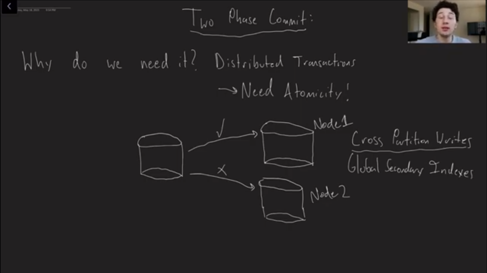
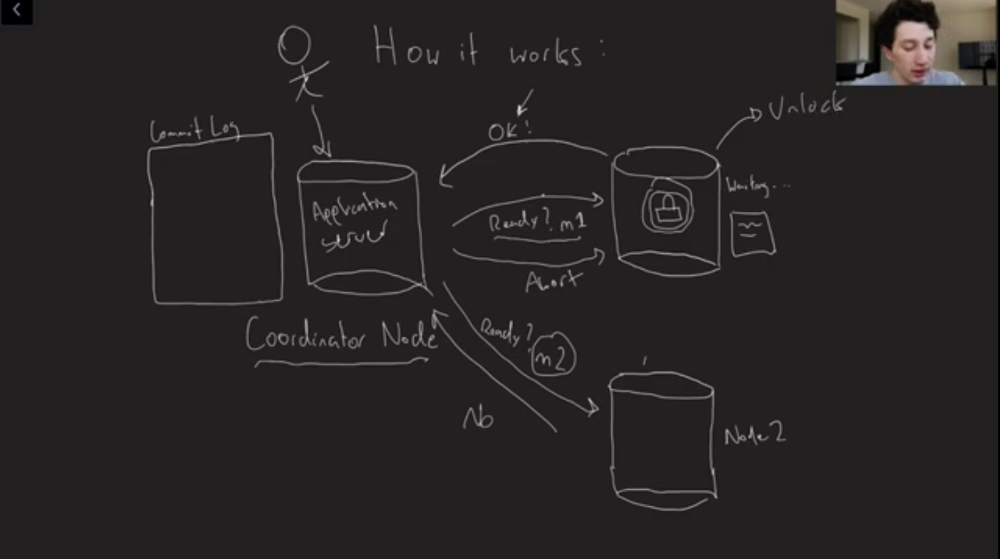
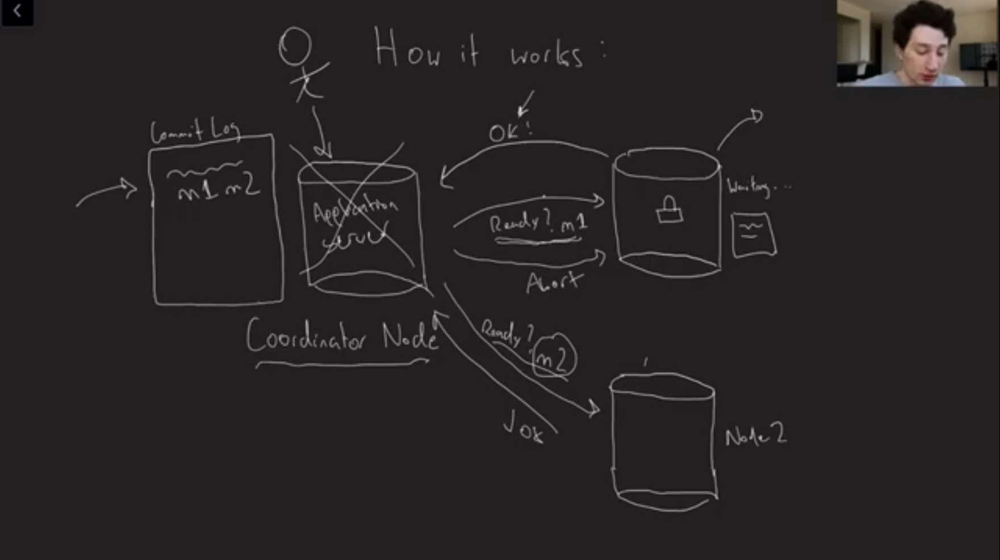
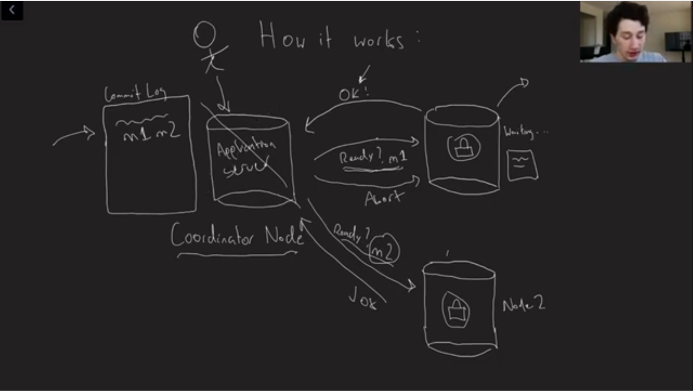
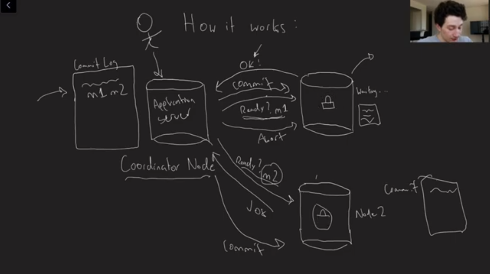
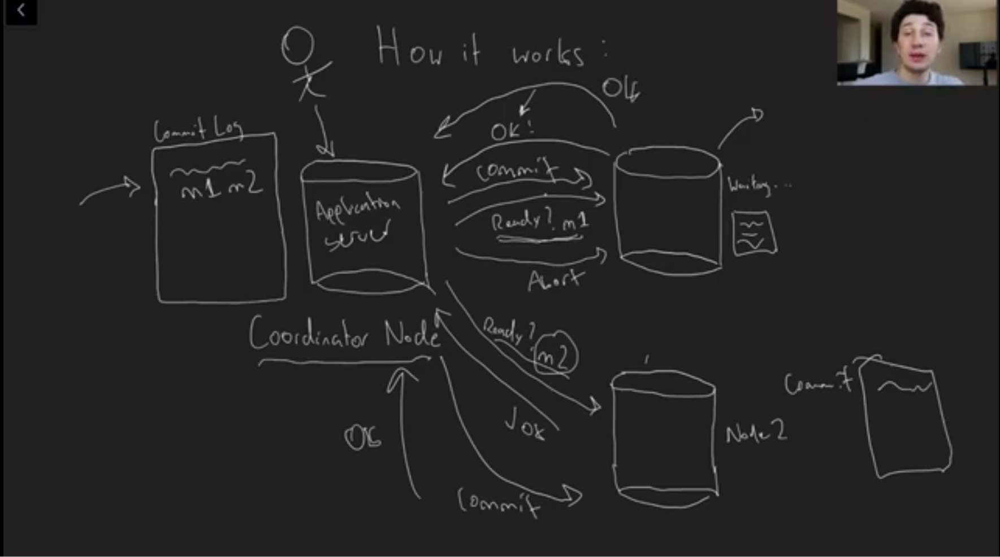
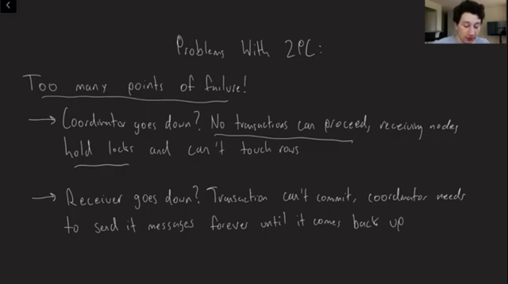
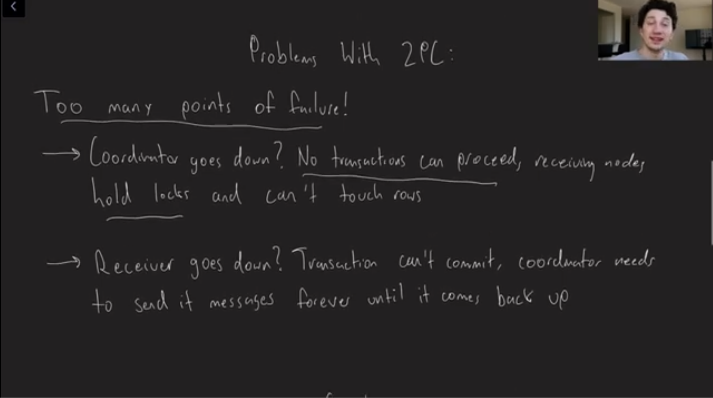
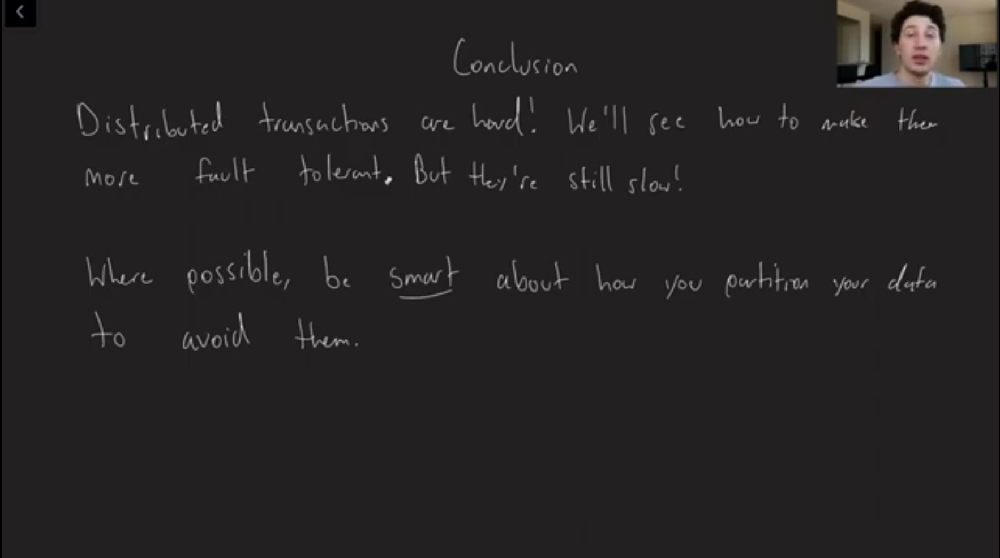

### 2 Phase Commit

1. Incorrect Reads are not acceptable since they shall be persisted and lead to incorrect results
2. Eventual Consistency is okay and acceptable

Image - 001

Image - 002

Image - 003

Image - 004

Image - 005

Image - 006

Image - 007

Image - 008

Image - 009

