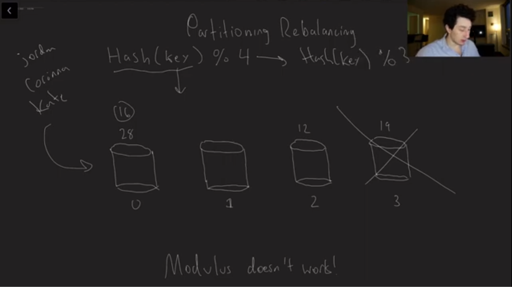
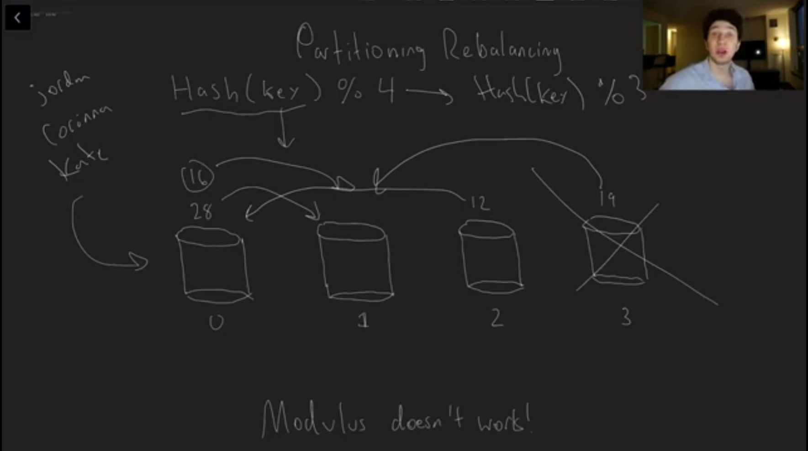
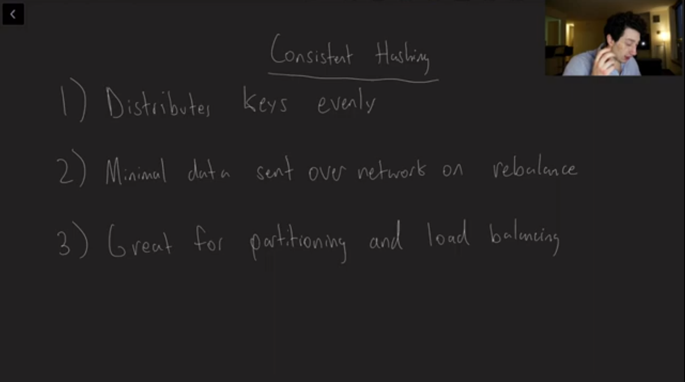
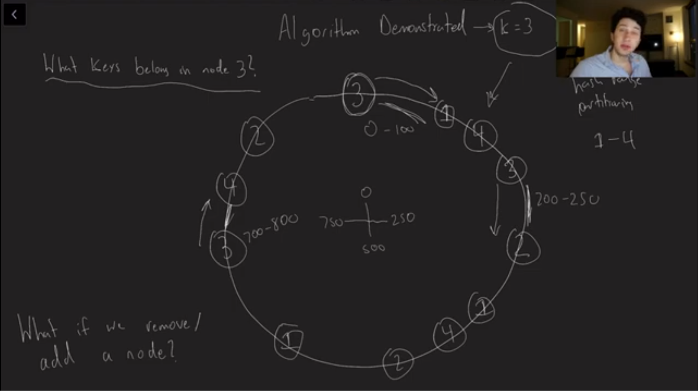
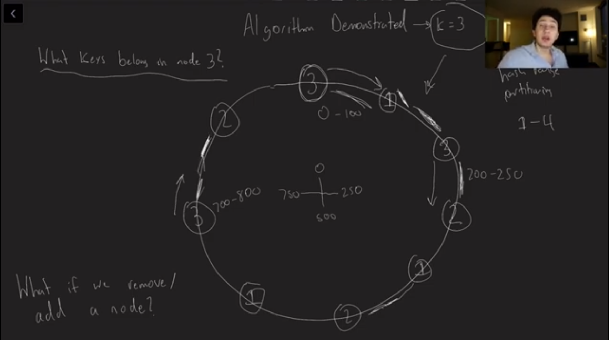
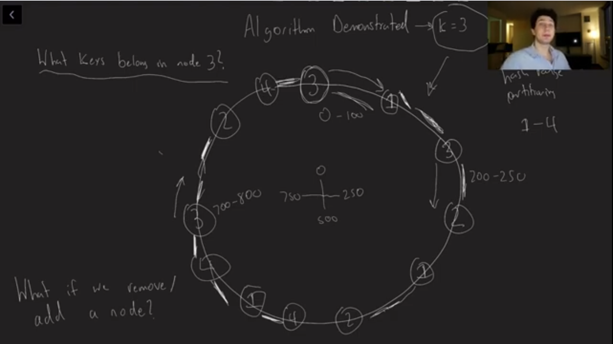
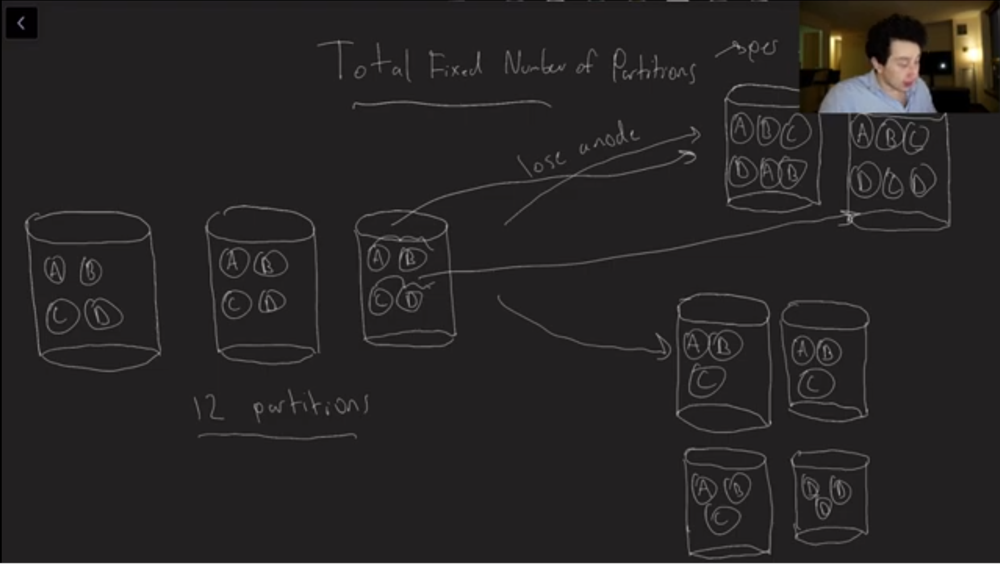
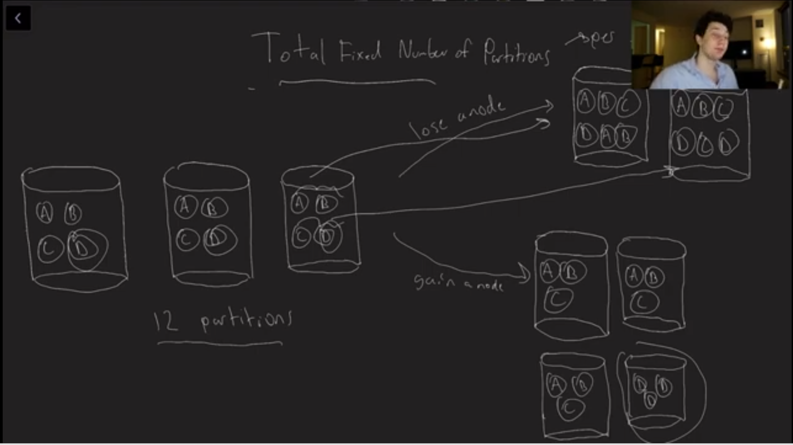
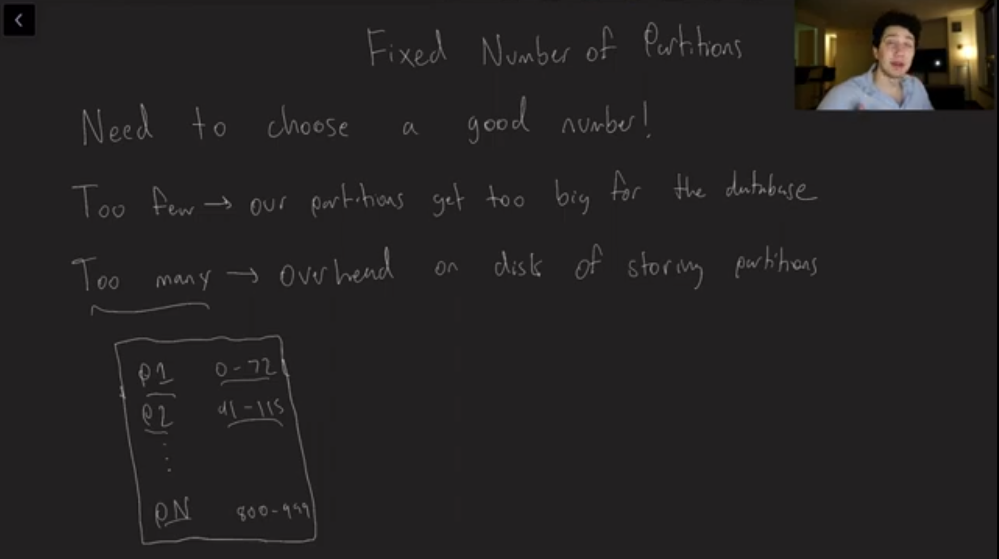

### Consistent Hashing

Image - 001

Image - 002

Image - 003

Image - 004

Image - 005

Image - 006

Image - 007

Image - 008

Image - 009

Image - 010

Image - 011

Image - 012

Image - 013

### Consistent hashing - Mathematical Guarantee

Consistent hashing does come with mathematical guarantees about how keys are distributed, though the guarantees depend on which variant of consistent hashing is used and what assumptions you make about the hash function. Let me break it down clearly:

⸻

1. Classic Consistent Hashing (Karger et al., 1997)
	•	Setup: Servers (or “buckets”) and keys are placed on a unit circle using a uniform hash function.
	•	Guarantee:
	•	If the hash function is truly uniform and independent, then the expected number of keys per server is proportional to its fraction of the circle length.
	•	The load imbalance (the maximum deviation from uniform distribution) is about O(\log N / N) for N servers, with high probability.
	•	More precisely: for n keys and N servers, each server gets about n/N keys in expectation, and with high probability no server gets more than O((n/N) \cdot \log N).
	•	Problem: With a small number of servers, variance is high (some servers may get large ranges). To smooth this out, virtual nodes (each server appears multiple times on the circle) are used.

⸻

2. Consistent Hashing with Virtual Nodes
	•	If each physical server has O(\log N) virtual nodes, the distribution of keys to servers becomes balanced with high probability:
	•	Each server gets at most a constant factor more than the average number of keys.
	•	Specifically, if each server has m virtual nodes and m = O(\log N), then the maximum load per server is (1 + \epsilon) \cdot (n/N) for small \epsilon, with high probability.

⸻

3. Modern Variants with Stronger Guarantees

Several later works improved the theoretical bounds:
	•	Balanced Allocations (“Power of Two Choices”):
Instead of mapping each key to one location, map it to two (or more) candidate servers and pick the less loaded. This gives much tighter bounds — maximum load is about n/N + O(\log \log N).
	•	Consistent Hashing with Bounded Loads (Mirrokni, Thorup, 2018):
Provides a scheme where no server exceeds a fixed multiple (say 1+\epsilon) of the average load, with high probability, even under churn.

⸻

4. Key Takeaway Guarantees
	•	Uniformity (Expectation): Each server gets ~equal share of keys.
	•	Balance (High Probability): With virtual nodes or bounded-load schemes, the maximum load per server is very close to the average (n/N).
	•	Stability: When adding/removing a server, only O(n/N) keys need to be moved, not O(n).